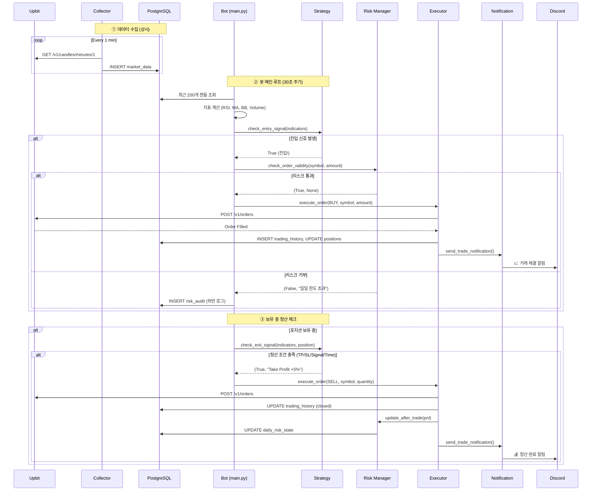

# CoinPilot v3.3 심층 학습 가이드 🚀

**작성일**: 2026-02-10  
**최종 업데이트**: 2026-02-23  
**목적**: 프로젝트를 완전히 내 것으로 만들기 위한 종합 학습 자료

---

## 운영 모드 업데이트 (2026-02-23)

- 기본 운영 모드: **Docker Compose**
- Minikube는 레거시/검증 모드로 유지
- 전환 배경/비교/보안 점검 기록:
  - `docs/troubleshooting/18-01_system_health_agent_decisions_and_data_sync.md`
  - `docs/work-plans/20_oci_paid_tier_security_and_cost_guardrails_plan.md`
  - `docs/work-result/20_oci_paid_tier_security_and_cost_guardrails_result.md`

---

## 📚 목차

1. [프로젝트 핵심 철학과 설계 원칙](#1-프로젝트-핵심-철학과-설계-원칙)
2. [시스템 아키텍처 완전 분석](#2-시스템-아키텍처-완전-분석)
3. [데이터 흐름과 상호작용](#3-데이터-흐름과-상호작용)
4. [기술 스택 선택 이유와 특징](#4-기술-스택-선택-이유와-특징)
5. [폴더/파일별 학습 경로](#5-폴더파일별-학습-경로)
6. [핵심 개념과 구현 원리](#6-핵심-개념과-구현-원리)
7. [프로젝트만의 강점과 차별점](#7-프로젝트만의-강점과-차별점)
8. [필수 학습 항목과 공부 방법](#8-필수-학습-항목과-공부-방법)

---

## 1. 프로젝트 핵심 철학과 설계 원칙

### 1.1 3대 핵심 철학

#### 🎯 **Reaction over Prediction (예측보다 대응)**
```
❌ "4시간 후 가격이 오를 것이다" (예측 기반)
✅ "RSI가 30 이하이고 거래량이 급증했다" (반응 기반)
```

**왜 이 철학인가?**
- 금융 시장의 가격 예측은 본질적으로 불가능에 가깝다
- 예측 모델(LSTM, Transformer)의 실전 적용은 과적합(Overfitting) 문제가 심각함
- **대신**: 시장 상태에 체계적으로 반응하는 Rule-Based 시스템으로 안정성 확보
- **포트폴리오 가치**: "AI로 돈을 번다"는 환상이 아닌, 실전에서 검증 가능한 엔지니어링 역량 증명

#### 🛡️ **Rule-Based Core + AI Assistant (AI는 보조, 거래는 규칙)**
```
[매매 결정 흐름]
시장 데이터 → Rule Engine (필수) → Risk Manager (필수) → Executor (실행)
              ↑
         AI Assistant (보조)
         - SQL Agent: 데이터 조회 지원
         - RAG Agent: 리스크 이벤트 감지
         - Volatility Model: 변동성 예측 → 포지션 크기 조절
```

**왜 AI를 직접 매매에 쓰지 않나?**
- LLM은 본질적으로 비결정적(Non-deterministic)이며, 실패 시 디버깅 불가
- 금전이 걸린 시스템에서는 **검증 가능성(Verifiability)**이 생명
- AI는 "도구 사용자(Tool User)"로 제한하여, 실패해도 시스템은 정상 작동

#### 📐 **Principled Engineering (Why가 없는 코드는 쓰지 않는다)**
- 모든 핵심 로직은 한국어 주석으로 "왜(Why)" 설명
- 예시: `src/engine/strategy.py`의 트레일링 스탑 로직
```python
# 트레일링 스탑: 수익이 발생하면 최고가를 추적하여,
# 하락 반전 시 이익을 확정 짓고 청산합니다.
# 이유: 과매수 구간(RSI > 70) 진입 후 조기 청산을 방지하여,
# 추세를 끝까지 따라가면서도 수익을 보호하기 위함.
```

---

### 1.2 프로젝트의 진짜 목표

> **이 프로젝트는 트레이딩 수익이 아닌, 4가지 핵심 역량의 증명입니다.**

| 역량 | 증명 방법 |
|------|-----------|
| **Quant Architecture** | 데이터 파이프라인(Collector), 백테스팅(Performance), 실행 엔진(Executor) 구현 |
| **LLM Agent Design** | LangGraph Multi-Agent 오케스트레이션, Tool-using, Memory(pgvector) |
| **MLOps/DevOps** | Docker Compose 운영, K8s 검증 자산, Prometheus/Grafana 모니터링, GitHub Actions CI/CD |
| **Finance Domain** | 리스크 관리(Risk Manager), 성과 측정(Sharpe/MDD), GARCH 변동성 모델 |

---

## 2. 시스템 아키텍처 완전 분석

### 2.1 High-Level Architecture (전체 구조도)

```
┌─────────────────────────────────────────────────────────────┐
│                   External World (외부)                       │
│  ┌──────────┐   ┌──────────┐   ┌──────────────┐             │
│  │ Upbit API│   │   User   │   │ Discord      │             │
│  └─────┬────┘   └─────┬────┘   └──────┬───────┘             │
└────────┼──────────────┼────────────────┼─────────────────────┘
         │              │                │
         │    ┌─────────▼────────────────▼─────────────────┐
         │    │ CoinPilot System (Compose Primary Runtime) │
         │    │  ┌─────────────────────────────────────┐   │
         └───▶│  │ 🟦 Collector (Data Ingestion)       │   │
              │  │   - WebSocket/REST로 시장 데이터 수집│   │
              │  │   - DB에 1분봉 저장 (TimescaleDB)   │   │
              │  └──────────┬──────────────────────────┘   │
              │             ▼                               │
              │  ┌─────────────────────────────────────┐   │
              │  │ 🟥 Rule Engine + Risk Manager       │   │
              │  │   - 전략: Mean Reversion + Regime   │   │
              │  │   - 리스크: 5% 한도, 3연패 쿨다운   │   │
              │  └──────────┬───────┬──────────────────┘   │
              │             │       │                       │
              │  ┌──────────▼───┐   │  ┌─────────────────┐ │
              │  │ 🟪 AI Agents │   │  │ 📉 Volatility   │ │
              │  │ - SQL Agent  │   │  │    Model (GARCH)│ │
              │  │ - RAG Agent  │   │  └─────────────────┘ │
              │  │ - Router     │   │                       │
              │  └──────────────┘   │                       │
              │             │        │                       │
              │  ┌──────────▼────────▼──────────────────┐   │
              │  │ 🗄️ PostgreSQL (TimescaleDB+pgvector)│   │
              │  │   - market_data (시계열)             │   │
              │  │   - trading_history (매매 기록)      │   │
              │  │   - document_embeddings (RAG)       │   │
              │  └─────────────────────────────────────┘   │
              │             │                               │
              │  ┌──────────▼──────────────────────────┐   │
              │  │ 🟩 Dashboard (Streamlit)            │   │
              │  │   - Overview, Market, Risk, Chatbot │   │
              │  │   - Auto Refresh, Bot Brain         │   │
              │  └─────────────────────────────────────┘   │
              │             │                               │
              │  ┌──────────▼──────────────────────────┐   │
              │  │ 🟧 Notification (n8n → Discord)     │   │
              │  │   - 거래 체결 알림                   │   │
              │  │   - 리스크 경고                      │   │
              │  │   - 일간 리포트                      │   │
              │  └─────────────────────────────────────┘   │
              └────────────────────────────────────────────┘
```

### 2.2 컴포넌트 상세 분석

| 컴포넌트 | 역할 | 핵심 파일 | 의존성 |
|----------|------|-----------|--------|
| **🟦 Collector** | Upbit API로부터 1분봉 데이터 수집 및 DB 저장 | `src/collector/main.py` | PostgreSQL |
| **🟥 Rule Engine** | 매매 규칙 평가, 진입/청산 신호 생성 | `src/engine/strategy.py` | DB, Redis |
| **🟥 Risk Manager** | 포지션 크기, 손절, 일일 한도 관리 | `src/engine/risk_manager.py` | DB, Redis |
| **🟥 Executor** | 주문 실행 및 Paper Trading 시뮬레이션 | `src/engine/executor.py` | Upbit API, DB |
| **🟪 SQL Agent** | 자연어 → SQL 변환 (Read-Only) | `src/agents/sql_agent.py` | LangChain, DB |
| **🟪 RAG Agent** | 문서 검색 및 Q&A | `src/agents/rag_agent.py` | LangChain, pgvector |
| **🟪 Router** | 사용자 의도 파악 및 Agent 라우팅 | `src/agents/router.py` | LangGraph |
| **📉 Volatility Model** | GARCH 모델로 변동성 예측 | `src/analytics/volatility_model.py` | arch, Redis |
| **🟩 Dashboard** | 실시간 모니터링 및 챗봇 UI | `src/dashboard/` | Streamlit, Redis |
| **🟧 Notification** | Discord 알림 전송 | `src/common/notification.py` | n8n Webhook |

---

## 3. 데이터 흐름과 상호작용

### 3.1 매매 실행 플로우 (거래 1회 전체 과정)



### 3.2 AI Agent 플로우 (챗봇 질의 처리)

```mermaid
graph TD
    A[User: "현재 잔고 얼마야?"] --> B[Dashboard Chatbot]
    B --> C[Router: classifier_node]
    C --> D{Intent 분류}
    D -->|"db_query"| E[SQL Agent]
    D -->|"doc_search"| F[RAG Agent]
    D -->|"general_chat"| G[General Node]
    
    E --> H[LangChain SQLDatabase Toolkit]
    H --> I[DB: SELECT balance FROM account_state]
    I --> J[Result: 10,000,000 KRW]
    J --> K["답변: 💰 현재 잔고는 10,000,000 KRW입니다."]
    
    F --> L[PGVector Similarity Search]
    L --> M[DB: document_embeddings]
    M --> N[Context: PROJECT_CHARTER 리스크 규칙]
    N --> O["답변: 📋 손절 규칙은 -3%입니다..."]
    
    G --> P["답변: 안녕하세요! CoinPilot 챗봇입니다."]
    
    K --> Q[User에게 응답 표시]
    O --> Q
    P --> Q
```

---

## 4. 기술 스택 선택 이유와 특징

### 4.1 Language & Framework

| 기술 | 선택 이유 | 우리 프로젝트만의 활용 |
|------|-----------|------------------------|
| **Python 3.10+** | 금융/AI 생태계 표준, Type Hinting으로 안정성 확보 | 모든 핵심 로직에 타입 힌트 적용, async/await 비동기 처리 |
| **FastAPI** | 비동기 API 서버, 자동 문서화(Swagger), Pydantic 검증 | `/health`, `/metrics` 엔드포인트로 K8s Readiness Probe |
| **Streamlit** | 빠른 대시보드 프로토타이핑, Python 네이티브 | Auto-refresh, Session State 활용한 실시간 모니터링 |

### 4.2 Database & Storage

| 기술 | 선택 이유 | 우리 프로젝트만의 활용 |
|------|-----------|------------------------|
| **PostgreSQL 16** | 범용성, 확장성 (TimescaleDB, pgvector 지원) | 단일 DB로 시계열 + 벡터 + 관계형 통합 |
| **TimescaleDB** | 시계열 데이터 압축 및 고속 조회 (Hypertable) | `market_data` 테이블을 Hypertable로 변환, 자동 압축 정책 |
| **pgvector** | PostgreSQL 내장 벡터 검색 (외부 DB 불필요) | ChromaDB/Pinecone 대신 사용, 운영 복잡도 감소 |
| **Redis** | 캐싱, 세션 관리, Pub/Sub | 레짐 캐싱(TTL 65분), HWM 저장, 변동성 결과 캐싱 |

**💡 왜 단일 PostgreSQL로 통합했나?**
- TimescaleDB + pgvector 조합으로 **3가지 DB를 1개로 통합** (운영 비용 절감)
- Join 쿼리 가능: `market_data`와 `trading_history`를 함께 분석
- 단일 백업/복구 프로세스

### 4.3 AI & ML Framework

| 기술 | 선택 이유 | 우리 프로젝트만의 활용 |
|------|-----------|------------------------|
| **LangChain** | LLM 애플리케이션 표준 프레임워크, Tool 추상화 | SQLDatabase Toolkit, RetrievalQA Chain |
| **LangGraph** | 복잡한 Multi-Agent 워크플로우 관리 (State Machine) | Router → (SQL/RAG/General) 라우팅 그래프 |
| **Claude 3.5 Haiku** | 빠른 응답 속도 + 합리적 비용 (Chatbot용) | 의도 분류, SQL 생성, RAG 답변 생성 |
| **GPT-4o-mini** | 비용 효율성 (Daily Reporter용) | 일간 리포트 LLM 요약 |
| **GARCH (arch 라이브러리)** | 금융 변동성 예측 표준 모델 | 일일 변동성 예측 → 포지션 크기 50% 축소 결정 |

**💡 왜 LSTM이 아닌 GARCH인가?**
- LSTM: 가격 예측 시도 → 과적합, 실전 실패율 높음
- GARCH: 변동성 예측 → 통계적으로 검증됨, 금융권 표준 (VaR 계산)

### 4.4 Infrastructure & DevOps

| 기술 | 선택 이유 | 우리 프로젝트만의 활용 |
|------|-----------|------------------------|
| **Docker** | 환경 격리, 재현 가능성 | 모든 서비스 컨테이너화 (Bot, Dashboard, DB, Monitoring) |
| **Docker Compose (Primary)** | 단일 노드 운영 단순화, 빠른 복구, 낮은 오버헤드 | `docker compose` 기반 운영/재배포 |
| **Kubernetes (Minikube, Legacy)** | 매니페스트 검증, K8s 학습/회귀 테스트 | `coin-pilot-ns` 검증 환경 유지 |
| **Prometheus** | 시계열 메트릭 수집 표준 | 5개 커스텀 메트릭 정의 (`coinpilot_*`) |
| **Grafana** | 메트릭 시각화 | 2개 대시보드 (Overview, Trades) |
| **GitHub Actions** | CI/CD 자동화 | `dev` 브랜치 push 시 pytest 자동 실행 |

**💡 왜 Compose 기본 + K8s 병행인가?**
- 현재 단일 VM 운영에서는 Compose가 비용/운영 복잡도 측면에서 유리
- K8s 자산은 검증/학습/향후 관리형 K8s(OKE/EKS) 전환 기반으로 유지

---

## 5. 폴더/파일별 학습 경로

### 5.1 학습 순서 (추천 경로)

```
Phase 1: 데이터 파이프라인 이해 (Week 1)
├─ src/common/models.py          [1️⃣ 필독] DB 스키마 정의
├─ src/collector/main.py         [2️⃣] Upbit API 연동 및 데이터 수집
└─ src/common/indicators.py      [3️⃣] 기술적 지표 계산 (RSI, MA, BB)

Phase 2: 매매 전략 이해 (Week 2)
├─ src/config/strategy.py        [4️⃣ 필독] 전략 설정 (Regime별 파라미터)
├─ src/engine/strategy.py        [5️⃣ 필독] 전략 로직 (진입/청산 조건)
├─ src/engine/risk_manager.py    [6️⃣ 필독] 리스크 관리 (한도, 쿨다운)
└─ src/engine/executor.py        [7️⃣] 주문 실행 (Paper Trading)

Phase 3: AI Agent 이해 (Week 3, 7)
├─ src/agents/config.py          [8️⃣] LLM 모델 설정
├─ src/agents/router.py          [9️⃣ 필독] LangGraph 라우팅
├─ src/agents/sql_agent.py       [🔟] SQL Agent 구현
└─ src/agents/rag_agent.py       [1️⃣1️⃣] RAG Agent 구현

Phase 4: 봇 메인 루프 이해 (Week 1-8 통합)
└─ src/bot/main.py               [1️⃣2️⃣ 필독] 봇 메인 로직, 스케줄러, FastAPI

Phase 5: 고급 기능 (Week 8)
├─ src/analytics/volatility_model.py  [1️⃣3️⃣] GARCH 모델
├─ src/analytics/performance.py      [1️⃣4️⃣] 성과 분석 (Sharpe, MDD)
└─ src/utils/metrics.py              [1️⃣5️⃣] Prometheus 메트릭

Phase 6: UI & Monitoring
├─ src/dashboard/app.py          [1️⃣6️⃣] 대시보드 메인
├─ src/dashboard/pages/06_chatbot.py [1️⃣7️⃣] 챗봇 UI
└─ deploy/monitoring/            [1️⃣8️⃣] Grafana 대시보드 JSON
```

### 5.2 핵심 파일 심층 분석

#### 📄 `src/common/models.py` - DB 스키마의 모든 것

**왜 중요한가?**  
모든 데이터의 구조를 정의. 이 파일을 이해하지 못하면 프로젝트 전체를 이해할 수 없음.

**학습 포인트:**
- SQLAlchemy ORM 사용법
- TimescaleDB Hypertable 선언 (`timescaledb_hypertable=True`)
- Enum 타입 사용 (`MarketRegime`, `TradeType`)
- Relationship 정의 (`positions`, `trading_history`)

**어떻게 읽을까?**
1. `MarketData` 클래스 → 시장 데이터 구조 파악
2. `Position` 클래스 → 포지션 관리 방법 이해
3. `TradingHistory` 클래스 → 매매 기록 추적 방법
4. `DailyRiskState` 클래스 → 리스크 상태 관리

---

#### 📄 `src/engine/strategy.py` - 전략의 핵심

**왜 중요한가?**  
돈이 왔다 갔다 하는 핵심 로직. 이 파일을 완벽히 이해해야 "나만의 전략"을 만들 수 있음.

**학습 포인트:**
- `MeanReversionStrategy` 클래스의 `check_entry_signal()` 메서드
  - 진입 조건: RSI, MA, Volume, BB 체크
  - 레짐별 분기 (`BULL`, `SIDEWAYS`, `BEAR`)
- `check_exit_signal()` 메서드
  - 청산 조건: TP, SL, 트레일링 스탑, RSI 과매수, 시간 제한
- `TrailingStop` 클래스
  - HWM(High Water Mark) 추적 원리

**코드 읽기 팁:**
```python
# 진입 조건 예시 (BULL 레짐)
if regime == "BULL":
    # MA20 위에 있거나 3% 이내 근접 (proximity_or_above)
    # → 상승 추세 확인 후 진입
    if indicators.get("proximity_or_above"):
        # 거래량 1.2배 이상 (volume_surge)
        # → 의미 있는 매수세 확인
        return True
```

---

#### 📄 `src/bot/main.py` - 시스템의 심장

**왜 중요한가?**  
모든 컴포넌트를 통합하는 메인 루프. 이 파일을 이해하면 전체 시스템 흐름이 보임.

**학습 포인트:**
- `bot_loop()` 함수: 30초마다 실행되는 메인 루프
  - 멀티 심볼 순회 (`for symbol in config.symbols`)
  - 지표 계산 → 전략 체크 → 리스크 체크 → 주문 실행
- `update_regime_job()`: 1시간마다 레짐 갱신
- `retrain_volatility_job()`: 매일 00:05에 GARCH 모델 재학습
- FastAPI `lifespan` 패턴: 봇 루프를 백그라운드 Task로 실행

**코드 읽기 팁:**
```python
# 메인 루프의 핵심 구조
while not SHUTDOWN:
    for symbol in symbols:
        # 1. 데이터 조회
        df = get_recent_candles(session, symbol)
        
        # 2. 지표 계산
        indicators = calculate_indicators(df)
        
        # 3. 전략 판단
        if strategy.check_entry_signal(indicators):
            # 4. 리스크 체크
            ok, reason = risk_manager.check_order_validity(...)
            if ok:
                # 5. 주문 실행
                executor.execute_order(...)
```

---

#### 📄 `src/agents/router.py` - LangGraph의 마법

**왜 중요한가?**  
Multi-Agent 시스템의 핵심. 이 파일을 이해하면 복잡한 AI 워크플로우를 설계할 수 있음.

**학습 포인트:**
- LangGraph `StateGraph` 사용법
- `classifier_node`: Fast Path(키워드) + Slow Path(LLM) 하이브리드
- `add_conditional_edges`: 동적 라우팅 구현
- Structured Output: `IntentDecision` Pydantic 모델

**코드 읽기 팁:**
```python
# 라우팅 그래프 구성
workflow = StateGraph(AgentState)
workflow.add_node("classifier", classifier_node)  # 의도 분류
workflow.add_node("sql_agent", sql_node)          # DB 조회
workflow.add_node("rag_agent", rag_node)          # 문서 검색
workflow.add_node("general_chat", general_node)   # 일반 대화

# 조건부 라우팅: classifier 결과에 따라 분기
workflow.add_conditional_edges(
    "classifier",
    lambda state: state["intent"],  # "db_query" or "doc_search" or "general_chat"
    {
        "db_query": "sql_agent",
        "doc_search": "rag_agent",
        "general_chat": "general_chat"
    }
)
```

---

## 6. 핵심 개념과 구현 원리

### 6.1 마켓 레짐 (Market Regime) - v3.0의 핵심

**개념:**  
시장 상태를 3가지로 분류하여, 각 상황에 맞는 전략을 적용.

```
BULL (상승장): MA50 > MA200 + 2%
└─ 진입: MA20 돌파 + 거래량 1.2배
└─ 청산: TP +5%, SL -3%, 트레일링 -2%

SIDEWAYS (횡보장): -2% < 이격도 < +2%
└─ 진입: BB 하단 터치 후 복귀
└─ 청산: TP +3%, SL -4%, 트레일링 -2.5%

BEAR (하락장): MA50 < MA200 - 2%
└─ 진입: 강한 과매도(RSI < 25) + 거래량 급증
└─ 청산: TP +3%, SL -5%, 트레일링 -3%
```

**구현:**
1. `src/common/indicators.py`의 `detect_regime()` 함수
2. 1분봉 → 1시간봉 리샘플링 (`resample_to_hourly()`)
3. MA50과 MA200의 이격도 계산
4. Redis 캐싱 (TTL 65분)

**왜 1시간봉인가?**
- 1분봉: 노이즈 과다, 레짐 변화 빈번 → 불안정
- 일봉: 반응 속도 느림, 레짐 변화 감지 지연
- **1시간봉**: 노이즈 필터링 + 적절한 반응 속도

---

### 6.2 트레일링 스탑 (Trailing Stop) - 수익 보호 메커니즘

**개념:**  
수익이 발생하면 최고가(HWM)를 추적하여, 일정 비율 하락 시 청산.

**예시:**
```
진입가: 1000원
활성화 조건: 수익률 +1% (1010원)

현재가 → 1020원: HWM = 1020원
현재가 → 1030원: HWM = 1030원 (갱신)
현재가 → 1009원: HWM 대비 -2% → 청산! (수익 보호)
```

**구현:**
- `src/engine/strategy.py`의 `TrailingStop` 클래스
- HWM은 Redis + DB 이중 저장 (`position:{symbol}:hwm`)

**왜 필요한가?**
- RSI > 70 조건만으로는 조기 청산 위험
- 추세를 끝까지 따라가되, 하락 반전 시 수익 확정

---

### 6.3 변동성 기반 포지션 사이징 (Volatility-Adjusted Position Sizing)

**개념:**  
변동성이 높을 때 포지션 크기를 축소하여 리스크 감소.

**계산:**
```python
# 정상 변동성
position_size = account_balance * 0.05  # 5%

# 고변동성 (GARCH 예측 결과)
position_size = account_balance * 0.05 * 0.5  # 2.5%로 축소
```

**구현:**
1. `src/analytics/volatility_model.py`: GARCH(1,1) 모델
   - 일일 00:05에 재학습 (`retrain_volatility_job()`)
   - Redis에 결과 캐싱 (`volatility:{symbol}`)
2. `src/engine/risk_manager.py`: `get_volatility_multiplier()`
   - Redis 조회 → `is_high` 판단 → 배율 반환 (0.5 or 1.0)

**왜 GARCH인가?**
- ARCH/GARCH는 금융 시계열 변동성 예측 표준 모델
- VaR(Value at Risk) 계산에 널리 사용됨 (Basel III)

---

### 6.4 리스크 관리 규칙 (Hard-coded Rules)

**5가지 절대 규칙:**

| 규칙 | 값 | PHP 코드 위치 | 위반 시 조치 |
|------|----|--------------|----- --------|
| 단일 포지션 한도 | 총 자산의 5% | `risk_manager.py:156` | 주문 거부 + 로그 |
| 일일 최대 손실 | -5% | `risk_manager.py:168` | 거래 중단 + 쿨다운 |
| 일일 최대 거래 | 10회 | `risk_manager.py:176` | 거래 중단 |
| 3연패 쿨다운 | 2시간 | `risk_manager.py:184` | 거래 중단 |
| 최소 거래 간격 | 30분 | `risk_manager.py:192` | 주문 지연 |

**왜 Hard-coded인가?**
- AI가 오버라이드할 수 없도록 보호
- DB 설정이 아닌 코드 레벨에서 강제 → 안전성 극대화

---

## 7. 프로젝트만의 강점과 차별점

### 7.1 일반 프로젝트 vs CoinPilot

| 일반적인 트레이딩 봇 | **CoinPilot v3.0** | **차별화 요소** |
|---------------------|--------------------|--------------------|
| "가격 예측 90% 정확도" 주장 | **예측 불가능성 인정, 대응 중심 설계** | 💡 현실적 접근 |
| 수익률만 강조 | **리스크 관리 + 실패 분석 문서화** | 📊 체계적 기록 |
| 로컬 실행 (Docker Compose) | **Compose 운영 + K8s 검증 + CI/CD** | 🚀 실전 인프라 |
| AI가 직접 매매 | **AI 실패 시에도 동작하는 Fallback** | 🛡️ 안정성 우선 |
| SQLAlchemy 기본 사용 | **TimescaleDB + pgvector 통합** | 🗄️ 단일 DB 전략 |
| 단일 전략 | **Regime별 적응형 전략** | 🎯 동적 대응 |
| Agent 단순 호출 | **LangGraph Multi-Agent + Router** | 🤖 고급 설계 |

### 7.2 기술 스택 활용의 강점

**PostgreSQL Ecosystem 완전 활용**
```
PostgreSQL 16
├─ TimescaleDB: 시계열 데이터 압축 (10배 절약)
├─ pgvector: 벡터 검색 (ChromaDB 대체)
└─ PostGIS: (미사용, 확장 가능성)
```
→ **단일 DB로 3가지 DB 역할** (운영 복잡도 감소)

**Compose 운영 + K8s 검증 자산**
```
7 Pods 운영
├─ bot (매매 봇)
├─ collector (데이터 수집)
├─ dashboard (Streamlit)
├─ db (PostgreSQL)
├─ redis (캐싱)
├─ prometheus (메트릭 수집)
└─ grafana (시각화)
```
→ **Self-healing, Auto-restart, ConfigMap/Secret 관리**

**LangGraph 활용**
```
Router Agent
├─ Fast Path: 키워드 매칭 (속도)
└─ Slow Path: LLM 분류 (정확도)
    ├─ SQL Agent: DB 조회
    ├─ RAG Agent: 문서 검색
    └─ General: 일반 대화
```
→ **하이브리드 라우팅으로 응답 속도 + 정확도 균형**

---

## 8. 필수 학습 항목과 공부 방법

### 8.1 기술별 학습 로드맵

#### 📘 **Python Advanced**

**필수 개념:**
1. **Async/Await** (`asyncio`)
   - 공부할 파일: `src/bot/main.py`, `src/agents/router.py`
   - 핵심: `async def`, `await`, `asyncio.gather()`, `asyncio.create_task()`
   - 연습: 동기 코드를 비동기로 변환해보기

2. **Type Hinting** (mypy)
   - 공부할 파일: `src/common/models.py`, `src/engine/strategy.py`
   - 핵심: `Optional[str]`, `List[Dict]`, `Literal["A", "B"]`
   - 연습: `mypy src/` 실행하여 타입 오류 확인

3. **SQLAlchemy ORM**
   - 공부할 파일: `src/common/models.py`, `src/common/db.py`
   - 핵심: `select()`, `insert()`, `update()`, `Relationship`
   - 연습: 새로운 테이블 추가 및 쿼리 작성

**추천 학습 자료:**
- [Real Python - Async IO](https://realpython.com/async-io-python/)
- [SQLAlchemy 2.0 Docs](https://docs.sqlalchemy.org/en/20/)

#### 📗 **LangChain & LangGraph**

**필수 개념:**
1. **LangChain Chains**
   - 공부할 파일: `src/agents/sql_agent.py`, `src/agents/rag_agent.py`
   - 핵심: `create_sql_query_chain()`, `create_retrieval_chain()`
   - 연습: 새로운 Chain 만들기 (예: 뉴스 요약 Chain)

2. **LangGraph State Machine**
   - 공부할 파일: `src/agents/router.py`
   - 핵심: `StateGraph`, `add_node()`, `add_conditional_edges()`
   - 연습: 분기 노드 추가 (예: "data_visualization" node)

3. **Tool Calling**
   - 공부할 파일: `src/agents/sql_agent.py`
   - 핵심: `SQLDatabase` Toolkit, Custom Tool 정의
   - 연습: 커스텀 Tool 추가 (예: "get_top_gainers" tool)

**추천 학습 자료:**
- [LangChain Docs - Agents](https://python.langchain.com/docs/modules/agents/)
- [LangGraph Tutorial](https://langchain-ai.github.io/langgraph/)

#### 📕 **Container Runtime & DevOps**

**필수 개념:**
1. **Docker Compose 운영**
   - 공부할 파일: `deploy/cloud/oci/docker-compose.prod.yml`
   - 핵심: 서비스 의존성, env fail-fast, 로컬 포트 바인딩
   - 연습: `docker compose ps`, `docker compose logs`, `docker compose up -d --build`
   - 보안: `scripts/security/preflight_security_check.sh`로 배포 전 점검 자동화

2. **K8s 매니페스트(레거시 검증)**
   - 공부할 파일: `k8s/apps/bot-deployment.yaml`
   - 핵심: `replicas`, `containerPort`, `ClusterIP`
   - 연습: `kubectl get pods`, `kubectl logs`, `kubectl exec`

3. **ConfigMap & Secret**
   - 공부할 파일: `k8s/monitoring/prometheus-config-cm.yaml`, `k8s/base/secret.yaml`
   - 핵심: 환경변수 주입, Volume Mount
   - 연습: `.env` 파일을 Secret으로 변환

4. **Prometheus & Grafana**
   - 공부할 파일: `src/utils/metrics.py`, `deploy/monitoring/dashboards/`
   - 핵심: `Counter`, `Gauge`, `Histogram`, Prometheus Query (PromQL)
   - 연습: 새 메트릭 추가 (예: `portfolio_diversification_score`)

**추천 학습 자료:**
- [Kubernetes 공식 문서](https://kubernetes.io/ko/docs/home/)
- [Prometheus 가이드](https://prometheus.io/docs/introduction/overview/)

#### 📙 **Finance & Quant**

**필수 개념:**
1. **기술적 지표 (Technical Indicators)**
   - 공부할 파일: `src/common/indicators.py`
   - 핵심: RSI, MA, Bollinger Bands, Volume Surge
   - 연습: [TradingView](https://www.tradingview.com/)에서 차트 보며 지표 이해

2. **리스크 관리 (Risk Management)**
   - 공부할 파일: `src/engine/risk_manager.py`
   - 핵심: Position Sizing, Stop Loss, Max Drawdown
   - 연습: 백테스트 결과에서 MDD, Sharpe Ratio 계산

3. **변동성 모델 (GARCH)**
   - 공부할 파일: `src/analytics/volatility_model.py`
   - 핵심: ARCH vs GARCH, 조건부 이분산성
   - 연습: `arch` 라이브러리 튜토리얼 실행

**추천 학습 자료:**
- [Investopedia - RSI](https://www.investopedia.com/terms/r/rsi.asp)
- [GARCH 모델 설명 (한글)](https://blog.quantylab.com/garch.html)

---

### 8.2 실전 학습 프로젝트

#### 🔨 **Mini Project 1: 새로운 전략 추가**

**목표**: "Momentum Breakout" 전략을 추가하여 프로젝트 구조 이해

**단계:**
1. `src/engine/strategy.py`에 `MomentumStrategy` 클래스 추가
2. 진입 조건: 가격이 20일 최고가 돌파 + 거래량 2배
3. 청산 조건: TP +7%, SL -4%
4. `src/bot/main.py`에서 전략 교체 테스트
5. 백테스트 실행: `python scripts/backtest_v3.py`

**학습 효과:**
- 전략 로직 이해
- 백테스트 프로세스 이해
- 성과 지표 해석

#### 🔨 **Mini Project 2: 새로운 Agent 추가**

**목표**: "News Agent"를 추가하여 최신 뉴스 요약

**단계:**
1. `src/agents/news_agent.py` 생성
2. NewsAPI 또는 RSS 피드 파싱
3. LangChain으로 뉴스 요약 Chain 구성
4. `src/agents/router.py`에 "news" Intent 추가
5. 대시보드에서 테스트: "최신 비트코인 뉴스 알려줘"

**학습 효과:**
- LangGraph 라우팅 확장
- 외부 API 연동
- Multi-Agent 설계 실습

#### 🔨 **Mini Project 3: 커스텀 메트릭 추가**

**목표**: Grafana에 "Portfolio Diversification" 패널 추가

**단계:**
1. `src/utils/metrics.py`에 `Gauge` 메트릭 추가
   ```python
   diversity_score = Gauge('coinpilot_diversity_score', 'Portfolio diversity (0-1)')
   ```
2. `src/bot/main.py`에서 계산 로직 추가 (예: HHI 지수)
3. Prometheus로 메트릭 확인: `http://localhost:30090/metrics`
4. Grafana 대시보드에 패널 추가 (PromQL 쿼리)

**학습 효과:**
- Prometheus 메트릭 설계
- Grafana 대시보드 커스터마이징
- 금융 지표 이해 (HHI, Portfolio Theory)

---

### 8.3 디버깅 & 트러블슈팅 학습

**필수 스킬:**

1. **로그 분석**
   ```bash
   # 봇 로그 확인
   kubectl logs -f coinpilot-bot-xxxxx -n coin-pilot-ns
   
   # 에러 패턴 검색
   kubectl logs coinpilot-bot-xxxxx | grep "ERROR"
   ```

2. **DB 쿼리 디버깅**
   ```bash
   # PostgreSQL 접속
   kubectl port-forward svc/db 5432:5432 -n coin-pilot-ns
   psql -h localhost -U coinpilot -d coinpilot_db
   
   # 최근 매매 기록 조회
   SELECT * FROM trading_history ORDER BY entry_time DESC LIMIT 10;
   ```

3. **Redis 상태 확인**
   ```bash
   # Redis 접속
   kubectl exec -it redis-xxxxx -n coin-pilot-ns -- redis-cli
   
   # 레짐 캐시 확인
   GET "market:regime:KRW-BTC"
   
   # HWM 확인
   GET "position:KRW-BTC:hwm"
   ```

**추천 문서:**
- `docs/troubleshooting/week8-ts.md`: 실제 트러블슈팅 사례 모음

---

## 🎯 마무리: 당신만의 CoinPilot 만들기

### 완벽한 이해를 위한 3단계

**1단계: 읽기 (Read)**
- [ ] `docs/PROJECT_CHARTER.md` 정독
- [ ] `docs/architecture/system_overview.md` 다이어그램 이해
- [ ] 핵심 파일 5개 라인별로 읽기
  - [ ] `src/common/models.py`
  - [ ] `src/engine/strategy.py`
  - [ ] `src/engine/risk_manager.py`
  - [ ] `src/bot/main.py`
  - [ ] `src/agents/router.py`

**2단계: 수정 (Modify)**
- [ ] Mini Project 1: 새로운 전략 추가
- [ ] Mini Project 2: 새로운 Agent 추가
- [ ] Mini Project 3: 커스텀 메트릭 추가

**3단계: 확장 (Extend)**
- [ ] 실거래 API 연동 (Paper → Real)
- [ ] 멀티 거래소 지원 (Upbit + Binance)
- [ ] 고급 백테스팅 (Monte Carlo 시뮬레이션)

---

**이 문서는 당신의 학습 여정의 시작입니다. 각 섹션을 반복해서 읽고, 코드를 직접 수정하며, 실패와 성공을 경험하세요. CoinPilot은 이제 당신의 것입니다! 🚀**
