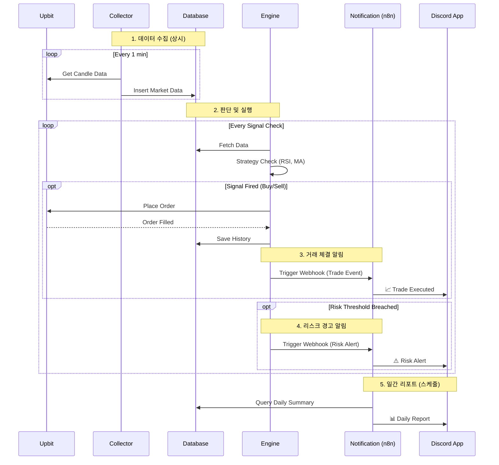
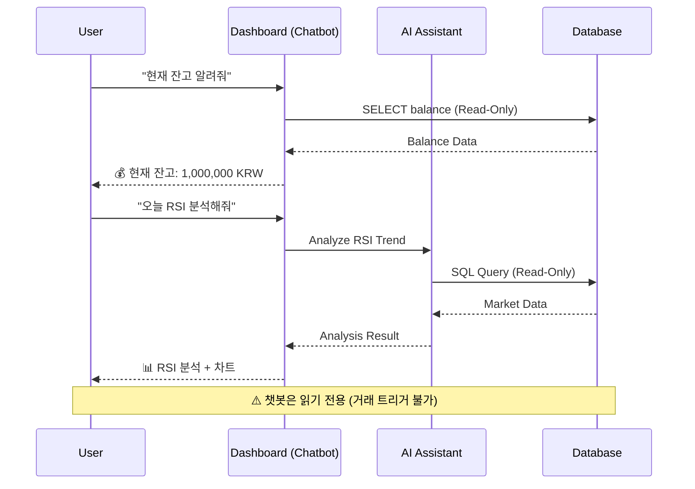

# CoinPilot v3.0 System Architecture & Flow

이 문서는 사용자가 시스템의 전체 그림을 그릴 수 있도록 **아키텍처(Architecture)**, **서비스 플로우(Service Flow)**, **데이터 플로우(Data Flow)**를 시각화하고 상세히 설명합니다.

---

## 1. High-Level Architecture (전체 구조도)

CoinPilot은 **MSA(Microservices Architecture)**를 지향하며, 크게 5가지 핵심 컴포넌트와 데이터베이스로 구성됩니다.

```mermaid
graph TD
    subgraph "External World"
        Upbit[Upbit API]
        User[User / Admin]
        Discord[Discord (Notifications)]
    end

    subgraph "CoinPilot System (Kubernetes Cluster)"
        direction TB

        %% Core Services
        Collector[🟦 **Collector**<br/>(Data Ingestion)]
        Engine[🟥 **Rule Engine**<br/>(Execution & Risk)]

        %% AI Layer
        subgraph "AI & Analytics"
            Assistant[🟪 **AI Assistant**<br/>(Analysis & SQL)]
            Volatility[📉 **Volatility Model**<br/>(GARCH/LSTM)]
        end

        %% Interface & Interaction
        Dashboard[🟩 **Dashboard**<br/>(Streamlit + Chatbot)]
        Notification[🟧 **Notification**<br/>(n8n Workflow)]

        %% Database Layer
        DB[(**PostgreSQL**<br/>TimescaleDB + pgvector)]
    end

    %% Flow Connections
    Upbit -- "WebSocket / REST" --> Collector
    Collector -- "Market Data" --> DB

    DB -- "Recent Data" --> Engine
    Engine -- "Orders" --> Upbit
    Engine -- "Trade History" --> DB

    %% AI Flows
    Assistant -- "RAG / SQL Queries" --> DB
    Assistant -- "Analysis Report" --> Engine
    Volatility -. "Position Sizing" .-> Engine

    %% Notification Flow (Week 5)
    Engine -- "Trade/Risk Events" --> Notification
    DB -- "Daily Summary" --> Notification
    Notification -- "Webhook" --> Discord

    %% User Interaction (Week 7)
    User -- "View / Chat" --> Dashboard
    Dashboard -- "Query Data (Read-Only)" --> DB
    Dashboard -- "AI Analysis" --> Assistant
```

### 아키텍처 설명
1.  **🟦 Collector (수집기)**: 외부(Upbit)에서 원자재(데이터)를 끊임없이 가져와 창고(DB)에 쌓는 **'광부'**입니다.
2.  **🟥 Rule Engine (매매 엔진)**: 창고의 데이터를 보고 판단하여 실제 주문을 내는 **'사령관'**입니다. 리스크 매니저가 감시합니다.
3.  **🟪 AI Assistant (참모)**: 사령관을 돕는 **'참모'**입니다. 복잡한 분석이나 과거 패턴 찾기를 담당합니다.
4.  **📉 Volatility Model (변동성 예측기)**: 변동성을 예측하여 Engine에 **포지션 사이징 제안**을 제공합니다.
5.  **🟩 Dashboard (상황실)**: 사용자가 현재 상태를 보고, **AI 챗봇**과 대화하며 정보를 조회하는 인터페이스입니다.
6.  **🟧 Notification (통신병)**: 중요한 사건(체결, 리스크 경고, 일일 리포트) 발생 시 **n8n**을 통해 사용자에게 보고(Discord)합니다.

---

## 2. Service Flow (서비스 흐름도)

실제 시스템이 어떻게 작동하는지 시간 순서대로 보시죠.

### 2.1 Trading & Notification Flow (매매 및 알림)



### 2.2 Chatbot Flow (챗봇 상호작용)



### 흐름 설명
1.  **수집(Collector)**은 묵묵히 데이터를 DB에 넣습니다.
2.  **엔진(Engine)**은 주기적으로 데이터를 보고 매매 여부를 판단합니다.
3.  주문이 체결되면 **거래 체결 알림(Trade Executed)**이 Discord로 발송됩니다.
4.  리스크 임계값 초과 시 **리스크 경고(Risk Alert)**가 즉시 발송됩니다.
5.  n8n 스케줄러가 매일 **일간 리포트(Daily Report)**를 생성하여 발송합니다.
6.  **챗봇**은 사용자의 질의에 응답하되, **읽기 전용**으로 동작하여 거래를 트리거할 수 없습니다.

---

## 3. Data Flow (데이터 흐름도)

데이터가 시스템 내부에서 어떻게 변환되고 저장되는지 보여줍니다.

```mermaid
flowchart LR
    %% Data Sources
    Raw[Raw JSON<br/>(Upbit)] -->|Validate| Pydantic[Pydantic Models]

    %% Storage
    subgraph "PostgreSQL Storage"
        MarketData[(Market Data<br/>TimescaleDB)]
        TradeHistory[(Trade History)]
        RiskLogs[(Risk Logs)]
    end

    %% Flows
    Pydantic -->|Save| MarketData
    Pydantic -->|Trade| TradeHistory

    %% Usage - Core
    MarketData -->|Analyze| Engine[Rule Engine]

    %% Usage - Notification (3 Types)
    TradeHistory -->|📈 Trade Executed| Notification[n8n Notification]
    RiskLogs -->|⚠️ Risk Alert| Notification
    TradeHistory -->|📊 Daily Report| Notification

    %% Usage - Chatbot (Read-Only)
    MarketData -.->|Read-Only| Chatbot[Dashboard Chatbot]
    TradeHistory -.->|Read-Only| Chatbot
```

### 데이터 설명
1.  **수집 데이터**: TimescaleDB 최적화 테이블에 저장되어 고속 조회에 사용됩니다.
2.  **매매/리스크 로그**: 일반 테이블에 저장되며, **알림 시스템**이 이를 참조합니다.
3.  **알림 유형 (3가지)**:
    - **📈 Trade Executed**: 거래 체결 시 즉시 발송
    - **⚠️ Risk Alert**: 리스크 임계값 초과 시 즉시 발송
    - **📊 Daily Report**: 매일 정해진 시간에 일간 요약 발송
4.  **챗봇 접근**: 모든 데이터에 **읽기 전용**으로 접근하여 잔고, 포지션, 지표 등을 조회합니다.

---

## 4. Component Summary (컴포넌트 요약)

| 컴포넌트 | 역할 | 주요 기능 | 권한 |
|---------|------|----------|------|
| **Collector** | 데이터 수집 | Upbit API → DB 저장 | Write (DB) |
| **Rule Engine** | 매매 실행 | 전략 평가, 주문 실행, 리스크 관리 | Read/Write |
| **AI Assistant** | 분석 보조 | SQL 변환, RAG 검색, 패턴 분석 | Read (DB) |
| **Volatility Model** | 변동성 예측 | 포지션 사이징 제안 | Read (DB) |
| **Dashboard** | 사용자 인터페이스 | 상태 조회, 차트, 챗봇 | Read (DB) |
| **Chatbot** | 대화형 분석 | 잔고/포지션 조회, 지표 분석, 매매 요약 | ⚠️ **Read-Only** |
| **Notification** | 알림 발송 | Trade/Risk/Daily → Discord | Read (DB) |

---

이 문서를 참고하면 전체 시스템이 어떻게 유기적으로 연결되어 있는지 한눈에 파악할 수 있습니다.
