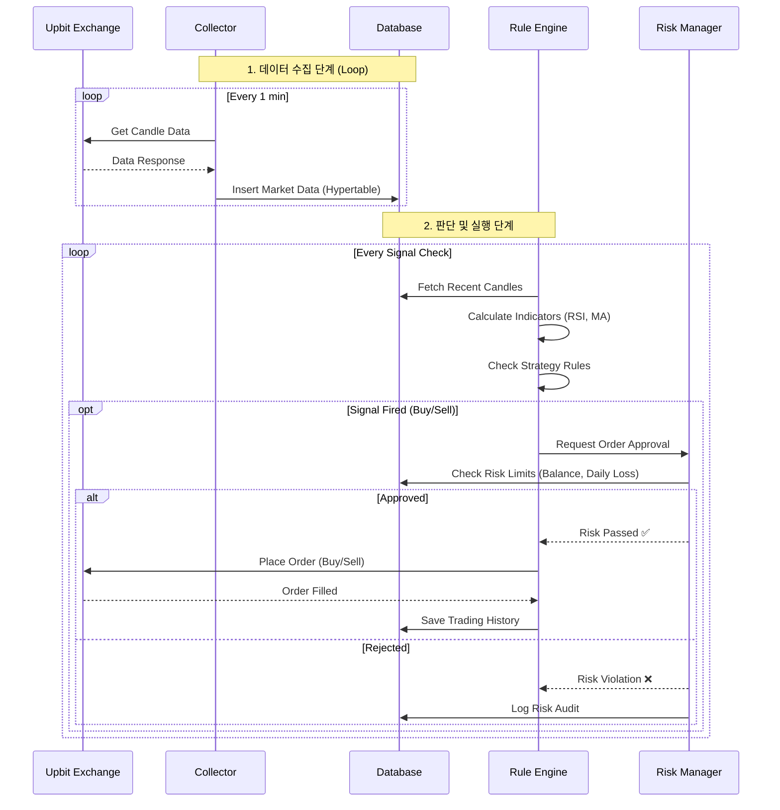

# CoinPilot v3.0 System Architecture & Flow

이 문서는 사용자가 시스템의 전체 그림을 그릴 수 있도록 **아키텍처(Architecture)**, **서비스 플로우(Service Flow)**, **데이터 플로우(Data Flow)**를 시각화하고 상세히 설명합니다.

---

## 1. High-Level Architecture (전체 구조도)

CoinPilot은 **MSA(Microservices Architecture)**를 지향하며, 크게 4가지 핵심 컴포넌트와 데이터베이스로 구성됩니다.

```mermaid
graph TD
    subgraph "External World"
        Upbit[Upbit API]
        Admin[User / Admin Dashboard]
    end

    subgraph "CoinPilot System (Docker/K8s)"
        direction TB
        
        %% Core Services
        %% Core Services
        Collector[🟦 **Collector**<br/>(Data Ingestion)]
        Engine[🟥 **Rule Engine**<br/>(Execution & Risk)]
        
        subgraph "AI & Analytics (Week 3)"
            Assistant[🟪 **AI Assistant**<br/>(Analysis & SQL)]
            Volatility[📉 **Volatility Model**<br/>(GARCH/LSTM)]
            Critic[🧐 **Critic Agent**<br/>(Self-Reflection)]
        end
        
        API[🟩 **API Server**<br/>(Dashboard Backend)]
        
        %% Database Layer
        DB[(**PostgreSQL**<br/>TimescaleDB + pgvector)]
    end

    %% Flow Connections
    Upbit -- "WebSocket / REST" --> Collector
    Collector -- "Market Data (Candles)" --> DB
    
    DB -- "Recent Data" --> Engine
    Engine -- "Orders (Buy/Sell)" --> Upbit
    Engine -- "Trade History" --> DB
    
    Assistant -- "RAG / SQL Queries" --> DB
    Assistant -- "Analysis Report" --> Engine
    Assistant -- "HALT Signal (RAG)" --> Engine
    
    Admin -- "View Status" --> API
    API -- "Query Data" --> DB
```

### 아키텍처 설명
1.  **🟦 Collector (수집기)**: 외부(Upbit)에서 원자재(데이터)를 끊임없이 가져와 창고(DB)에 쌓는 **'광부'**입니다. 죽으면 안 됩니다.
2.  **🟥 Rule Engine (매매 엔진)**: 창고의 데이터를 보고 판단하여 실제 주문을 내는 **'사령관'**입니다. 리스크 매니저가 옆에서 감시합니다.
3.  **🟪 AI Assistant (참모)**: 사령관을 돕는 **'참모'**입니다. 복잡한 분석이나 과거 패턴 찾기를 담당하지만, 결정권은 없습니다.
4.  **🟩 API Server (상황실)**: 사용자가 현재 상태를 볼 수 있게 해주는 **'스크린'**입니다.

---

## 2. Service Flow (서비스 흐름도)

실제 시스템이 어떻게 작동하는지 시간 순서대로 보시죠.



### 흐름 설명
1.  **수집(Collector)**은 세상이 무너져도 묵묵히 데이터를 DB에 넣습니다.
2.  **엔진(Engine)**은 주기적으로 깨어나 DB에서 최신 데이터를 봅니다.
3.  **전략(Strategy)** 조건이 맞으면(예: RSI < 30), 바로 주문을 내지 않고 **리스크 매니저(Risk Manager)**에게 결재를 올립니다.
4.  **리스크 매니저**는 "오늘 너무 많이 잃지 않았나?", "돈이 충분한가?"를 따져보고 승인(Approve)하거나 거절(Reject)합니다.
5.  승인되면 실제로 업비트에 주문이 나갑니다.

---

## 3. Data Flow (데이터 흐름도)

데이터가 시스템 내부에서 어떻게 변환되고 저장되는지 보여줍니다.

```mermaid
flowchart LR
    %% Data Sources
    Raw[Raw JSON Data<br/>(from Upbit)] -->|Validating| Pydantic[Pydantic Models]
    
    %% Processing
    Pydantic -->|Transforming| ORM[SQLAlchemy ORM Models]
    
    %% Storage
    subgraph "PostgreSQL Storage"
        ORM -->|Time-Series| MarketData[(Market Data<br/>Hypertable)]
        ORM -->|Transactional| TradeHistory[(Trading History)]
        ORM -->|Violation Log| RiskAudit[(Risk Audit)]
        ORM -->|Vector Embedding| AgentMem[(Agent Memory<br/>pgvector)]
    end
    
    %% Usage
    MarketData -->|Aggregation| Indicators[Technical Indicators<br/>(RSI, BB, MA)]
    TradeHistory -->|Audit| RiskCheck[Risk Analysis]
    RiskCheck -.->|Related Order| RiskAudit
    AgentMem -->|Similarity Search| RAG[RAG Retrieval]
```

### 데이터 설명
1.  **Raw → Model**: 지저분한 API 응답(JSON)을 깔끔하고 엄격한 파이썬 객체(Pydantic)로 정제합니다.
2.  **Model → Storage**: 정제된 데이터를 성격에 맞는 DB 테이블에 넣습니다.
    -   가격 데이터 → **TimescaleDB** (시간순 정리)
    -   매매 기록 → **일반 테이블** (정확성 중요)
    -   AI 기억 → **Vector** (유사도 검색용)
3.  **Storage → Insight**: 저장된 데이터는 다시 꺼내져서 보조지표(RSI 등)나 리스크 분석 자료로 재가공됩니다.

---

이 문서를 참고해서 그림을 그리시면, 전체 시스템이 어떻게 유기적으로 연결되어 있는지 한눈에 파악하실 수 있을 겁니다!
