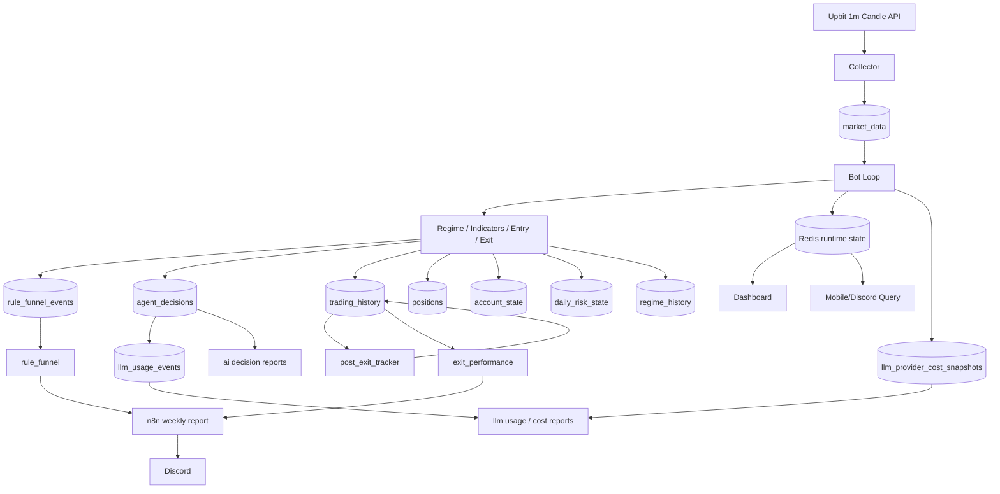

# CoinPilot 데이터 플로우 레퍼런스

작성일: 2026-03-10  
대상: AI Engineer / MLOps 포트폴리오 / 면접 준비  
검증 기준: 코드 3회 교차 확인(`collector`, `bot`, `models`, `analytics`, `llm_usage`, `compose`)

---

## 1. 문서 목적

이 문서는 CoinPilot에서 데이터가 어디서 들어와서, 어떤 저장소를 거쳐, 어떤 분석/알림/리포트로 소비되는지를 정리한다.  
면접에서는 "어떤 테이블이 source of truth였는가", "Redis와 PostgreSQL의 역할이 어떻게 달랐는가", "LLM usage와 rule funnel 같은 운영 데이터가 왜 별도 스키마를 가졌는가"를 설명할 때 활용하면 된다.

---

## 2. 핵심 데이터 흐름 한눈에 보기

---

## 3. 데이터 소스별 상세 흐름

### 3.1 시장 데이터

소스:
- Upbit 1분봉 REST API

경로:
1. Collector가 Upbit에서 캔들 조회
2. `market_data`에 적재
3. Bot이 최근 캔들을 다시 읽어 지표 계산
4. Regime 계산과 전략 평가에 사용
5. Dashboard/챗봇/분석기에서도 동일한 테이블을 참조

관련 코드:
- [src/collector/main.py](/home/syt07203/workspace/coin-pilot/src/collector/main.py)
- [src/common/models.py](/home/syt07203/workspace/coin-pilot/src/common/models.py)
- [src/bot/main.py](/home/syt07203/workspace/coin-pilot/src/bot/main.py)

핵심 포인트:
- `market_data`는 source-of-truth다.
- Bot은 실시간으로 Upbit를 직접 다시 치기보다 DB를 읽어서 판단한다.
- 이 구조 덕분에 수집 지연과 전략 판단 지연을 분리할 수 있다.

---

### 3.2 진입/청산 데이터

소스:
- Bot의 Rule Engine / RiskManager / Executor

경로:
1. Bot이 `market_data`를 읽어 지표 계산
2. Strategy가 entry 또는 exit 여부 판단
3. RiskManager가 absolute limit 검사
4. Executor가 체결 결과를 `trading_history`, `positions`, `account_state`에 기록
5. SELL 이후 `post_exit_prices`를 추적하여 동일 `trading_history` row에 후속 가격을 덧붙임

핵심 테이블:
- `trading_history`
- `positions`
- `account_state`
- `daily_risk_state`

왜 이렇게 나눴는가:
- `trading_history`: 체결 이력과 사후 분석 근거
- `positions`: 현재 상태
- `account_state`: 자금 상태
- `daily_risk_state`: 당일 제한/연패/쿨다운 같은 운영성 상태

---

### 3.3 레짐 데이터

소스:
- Bot scheduler의 `update_regime_job`

경로:
1. Bot이 `market_data`에서 1시간봉 재구성용 1분봉을 읽음
2. `MA50`, `MA200` 계산
3. `BULL / SIDEWAYS / BEAR / UNKNOWN` 판단
4. Redis `market:regime:{symbol}`에 캐시
5. `regime_history`에도 append-only로 저장

의미:
- Redis는 "현재 레짐"
- PostgreSQL은 "레짐 이력"

이중 저장 이유:
- 매매 루프는 빠른 현재값이 필요해서 Redis 사용
- 분석/감사/대시보드는 과거 이력이 필요해서 DB 사용

---

### 3.4 AI 판단 데이터

소스:
- `Analyst -> Guardian` 워크플로우

경로:
1. Rule pass + Risk pass 이후에만 AI 판단 경로 진입
2. Analyst가 `CONFIRM/REJECT + confidence` 생성
3. 필요 시 Guardian이 `SAFE/WARNING` 검토
4. 최종 결과를 `agent_decisions`에 기록
5. 같은 시점에 `rule_funnel_events`에 `ai_confirm` 또는 `ai_reject` 이벤트도 함께 기록

핵심 테이블:
- `agent_decisions`
- `rule_funnel_events`

왜 둘 다 필요한가:
- `agent_decisions`는 개별 reasoning과 confidence를 남긴다.
- `rule_funnel_events`는 병목 분석용 축약 이벤트다.
- 즉, 하나는 상세 로그, 하나는 운영 분석용 fact table에 가깝다.

---

### 3.5 Rule Funnel 데이터

소스:
- Bot 루프와 AgentRunner의 분기점

기록 시점:
- `rule_pass`
- `risk_reject`
- `ai_prefilter_reject`
- `ai_guardrail_block`
- `ai_confirm`
- `ai_reject`

의미:
- "AI decision이 적다" 같은 현상을 직접 분해할 수 있게 한다.
- 예를 들어 최근 운영 데이터에서는 `SIDEWAYS rule_pass=113`, `risk_reject=108`, `max_per_order=102`가 확인되어, AI 이전 단계의 병목임을 알 수 있었다.

관련 코드:
- [src/common/rule_funnel.py](/home/syt07203/workspace/coin-pilot/src/common/rule_funnel.py)
- [src/analytics/rule_funnel.py](/home/syt07203/workspace/coin-pilot/src/analytics/rule_funnel.py)
- [29-01 result](/home/syt07203/workspace/coin-pilot/docs/work-result/29-01_bull_regime_rule_funnel_observability_and_review_automation_result.md)

---

### 3.6 LLM Usage / Cost 데이터

소스:
- Chat/RAG/AI Decision/Daily Report 경로의 LLM 호출
- Provider 비용 snapshot job

경로:
1. LLM 호출 시 callback 또는 helper에서 usage 수집
2. `llm_usage_events`에 route/provider/model/status/input/output/total_tokens/estimated_cost 저장
3. scheduler가 provider cost snapshot을 수집하면 `llm_provider_cost_snapshots`에 저장
4. 두 테이블을 대조해 reconciliation 리포트 생성

핵심 이유:
- 내부 usage ledger와 외부 provider cost를 분리해야, 어떤 route가 비용을 만들었는지와 실제 청구 비용을 동시에 볼 수 있다.

현 상태:
- usage ledger는 동작 중
- provider snapshot은 아직 관측 공백이 있어 [21-04 result](/home/syt07203/workspace/coin-pilot/docs/work-result/21-04_llm_token_cost_observability_dashboard_result.md) 기준 `in_progress`

---

### 3.7 인터페이스 데이터

#### Dashboard
- DB와 Redis를 읽어 현재 상태/이력/시장/리스크를 표시
- floating chat로 Router/Agent 계층 호출

#### Mobile Query API
- read-only internal API
- `/positions`, `/pnl`, `/risk`, `/status`, `/ask`
- Discord Bot이 이 API를 친다

#### Discord / n8n
- Bot이 webhook 호출
- n8n이 메시지 형식을 구성해서 Discord에 전송

의미:
- 거래 엔진과 사용자 인터페이스 경로를 분리함으로써 read/write 경계를 명확히 유지한다.

---

## 4. 저장소 역할 분리

### 4.1 PostgreSQL / TimescaleDB

역할:
- 영속 데이터 저장
- 사후 분석
- 대시보드/리포트 source of truth

대표 테이블:
- `market_data`
- `trading_history`
- `positions`
- `agent_decisions`
- `rule_funnel_events`
- `llm_usage_events`
- `llm_provider_cost_snapshots`

장점:
- 운영 기록이 남는다.
- 분석/백테스트/리포트에 재사용할 수 있다.

트레이드오프:
- 실시간 제어용 값은 매번 DB를 읽으면 무겁다.
- 그래서 Redis와 역할을 분리했다.

### 4.2 Redis

역할:
- 현재 레짐 캐시
- bot status
- volatility state
- AI guardrail/cooldown/counter

장점:
- 빠른 읽기/쓰기
- runtime state 제어에 적합

트레이드오프:
- 영속 분석에는 부적합
- 장애 시 일부 값은 재계산이 필요

---

## 5. 실거래 Upbit 연동 가정 시 데이터 플로우 변화

현재 코드 기준:
- 주문 체결은 paper trading DB update

실거래 가정 시 변화:
1. `Executor`가 Upbit 주문 API를 호출
2. 주문 응답(주문 ID, 체결 가격, 수수료, 상태)을 받아 저장
3. `trading_history`에 실제 주문 메타데이터가 더 풍부하게 기록
4. 나머지 하위 분석 계층(`post_exit_tracker`, `exit_performance`, `rule_funnel`, `strategy_feedback`)은 동일 구조로 재사용 가능

즉, 핵심 데이터 플로우는 바뀌지 않고 "주문 발생 source"만 paper simulator에서 exchange API로 바뀐다.

---

## 6. 이 문서로 면접에서 답할 수 있어야 하는 질문

1. source of truth는 무엇인가?
2. Redis와 PostgreSQL을 왜 둘 다 썼는가?
3. AI 판단 로그와 Rule Funnel 이벤트를 왜 따로 저장했는가?
4. 비용 관측에서 usage ledger와 provider snapshot을 왜 나눴는가?
5. 실거래로 전환되면 어떤 데이터 흐름만 바뀌고, 무엇은 그대로 재사용되는가?

---

## 7. 참조

- [models.py](/home/syt07203/workspace/coin-pilot/src/common/models.py)
- [collector/main.py](/home/syt07203/workspace/coin-pilot/src/collector/main.py)
- [main.py](/home/syt07203/workspace/coin-pilot/src/bot/main.py)
- [runner.py](/home/syt07203/workspace/coin-pilot/src/agents/runner.py)
- [llm_usage.py](/home/syt07203/workspace/coin-pilot/src/common/llm_usage.py)
- [rule_funnel.py](/home/syt07203/workspace/coin-pilot/src/analytics/rule_funnel.py)
- [Data_Flow.md](/home/syt07203/workspace/coin-pilot/docs/Data_Flow.md)
- [29-01 result](/home/syt07203/workspace/coin-pilot/docs/work-result/29-01_bull_regime_rule_funnel_observability_and_review_automation_result.md)
- [21-04 result](/home/syt07203/workspace/coin-pilot/docs/work-result/21-04_llm_token_cost_observability_dashboard_result.md)
