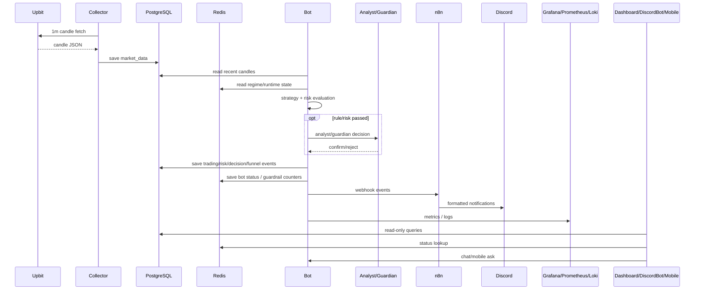
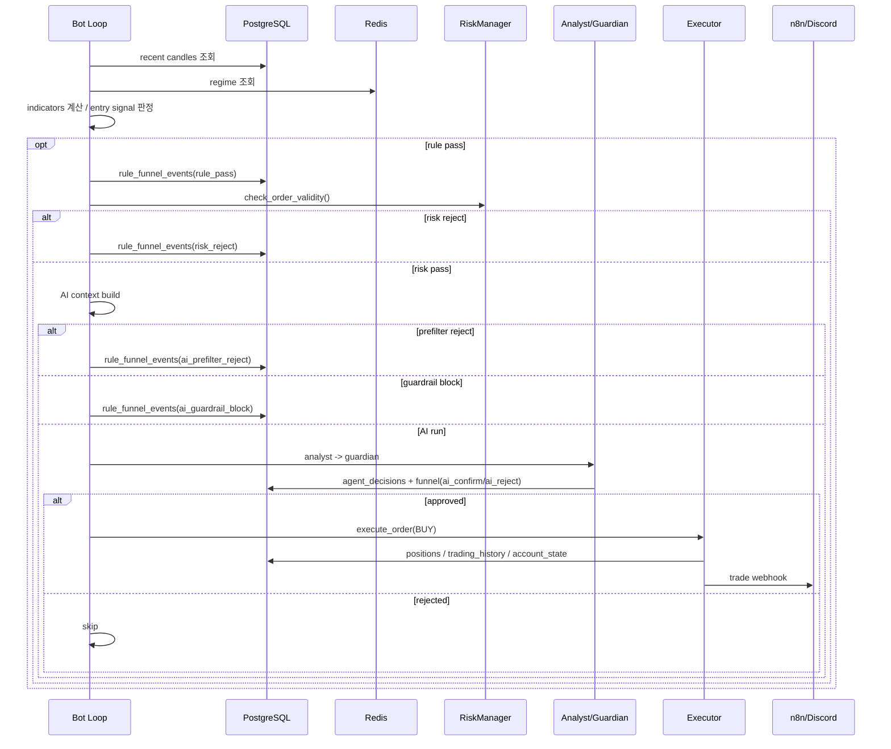

# CoinPilot 서비스 플로우 레퍼런스

작성일: 2026-03-10  
대상: AI Engineer / MLOps 포트폴리오 / 면접 준비  
설명 원칙: 현재 코드 경로를 기준으로 작성하되, 주문 실행은 사용자 요청에 따라 "실거래 Upbit 연동 완료" 가정 흐름을 함께 병기

---

## 1. 문서 목적

이 문서는 CoinPilot의 실제 서비스 동작을 시간 순서로 설명한다.  
아키텍처 문서가 "구성 요소와 역할"에 초점을 둔다면, 이 문서는 시스템이 실제로 어떻게 움직이는지에 초점을 둔다.

핵심적으로 다루는 흐름:
1. 시장 데이터 수집
2. 매수 판단
3. 매도 판단
4. 챗봇/모바일/Discord 조회
5. 모니터링/알림
6. 주간 리포트와 전략 피드백

---

## 2. 서비스 플로우 전체 그림

---

## 3. 플로우 A: 시장 데이터 수집

### 현재 코드 기준

1. Collector가 Upbit 1분봉 API를 호출한다.
2. 신규 캔들을 `market_data`에 저장한다.
3. 서버 재시작이나 장애 이후에는 backfill로 누락 구간을 보정한다.

관련 코드:
- [collector/main.py](/home/syt07203/workspace/coin-pilot/src/collector/main.py)

운영 의도:
- 거래 루프와 데이터 적재를 분리해 수집 장애가 매매 판단 로직 전체를 흔들지 않게 한다.

면접용 설명:

> 데이터 수집은 별도 Collector 서비스가 담당하고, Bot은 DB를 읽어 판단합니다. 그래서 데이터 수집 지연과 전략 판단 오류를 운영적으로 분리할 수 있습니다.

---

## 4. 플로우 B: 매수(BUY) 서비스 플로우

### 4.1 현재 구현 플로우

1. Bot이 `market_data`에서 최근 200개 캔들을 읽는다.
2. `get_all_indicators()`로 RSI, MA, BB, volume ratio 등을 계산한다.
3. Redis의 `market:regime:{symbol}`를 읽어 현재 레짐을 가져온다.
4. `strategy.check_entry_signal()`이 규칙 기반 진입 후보를 판정한다.
5. 통과하면 `rule_funnel_events`에 `rule_pass` 기록
6. `RiskManager.check_order_validity()`가
   - 단일 주문 한도
   - 총 노출 한도
   - 중복 포지션 금지
   - 일일 손실/쿨다운
   등을 검사한다.
7. 리스크에서 막히면 `risk_reject` 기록
8. 통과 시 AI용 추가 컨텍스트(최대 36h 1분봉 -> 1시간봉 리샘플) 생성
9. `should_run_ai_analysis()`로 prefilter
10. guardrail(쿨다운/버짓/global block) 검사
11. 통과 시 `Analyst -> Guardian` 실행
12. `CONFIRM/SAFE`일 때만 Executor 실행
13. 성공 시 `BUY`가 기록되고, 상태/알림/메트릭이 갱신된다.

### 4.2 서비스 플로우 다이어그램

### 4.3 실거래 Upbit 연동 가정 버전

현재는 `PaperTradingExecutor`가 DB 상태를 갱신한다.  
실거래 가정에서는 다음 한 단계만 바뀐다.

1. `Executor`가 Upbit 주문 API를 호출
2. 주문 응답을 받아 체결 정보/수수료/주문 ID를 저장
3. 나머지 Rule, Risk, AI, Funnel, Notification 흐름은 동일

즉, 서비스 플로우 관점에서 실거래 전환은 "판단 플로우 전체 변경"이 아니라 "체결 boundary 변경"이다.

---

## 5. 플로우 C: 매도(SELL) 서비스 플로우

1. Bot이 현재 포지션이 있으면 `check_exit_signal()`을 실행한다.
2. `TAKE_PROFIT`, `STOP_LOSS`, `TRAILING_STOP`, `RSI_OVERBOUGHT`, `TIME_LIMIT` 등을 점검한다.
3. 청산 조건이 충족되면 Executor가 `SELL` 실행
4. `trading_history`에 `exit_reason`과 함께 기록
5. `risk_manager.update_after_trade()`가 PnL, 연패, halt 상태를 갱신
6. 이후 `post_exit_tracker`가 1h/4h/12h/24h 후속 가격을 기록한다.

왜 중요한가:
- 단순히 체결 이력만 남기는 게 아니라, "팔고 나서 어떻게 됐는지"까지 저장해 사후 분석 근거를 만든다.

관련 코드:
- [main.py](/home/syt07203/workspace/coin-pilot/src/bot/main.py)
- [post_exit_tracker.py](/home/syt07203/workspace/coin-pilot/src/analytics/post_exit_tracker.py)
- [exit_performance.py](/home/syt07203/workspace/coin-pilot/src/analytics/exit_performance.py)

---

## 6. 플로우 D: 챗봇 / Dashboard / Mobile / Discord Query

### 6.1 Dashboard

1. 운영자가 Streamlit Dashboard 접속
2. DB와 Redis에서 현재 상태/이력/시장 정보를 읽음
3. floating chat에서 질문을 입력하면 Router가 intent를 분류
4. SQL / RAG / review / risk diagnosis tool 중 적절한 경로로 분기

### 6.2 Discord Bot

1. 사용자가 `/positions`, `/pnl`, `/status`, `/risk`, `/ask` 실행
2. Discord Bot이 internal mobile API를 호출
3. Bot의 read-only API가 DB/Redis/agent를 조회
4. 응답을 Discord 메시지로 포맷

### 6.3 Mobile Query API

핵심 보안 원칙:
- `X-Api-Secret` required
- read-only internal endpoint
- trading loop와 query 채널 분리

이 흐름을 강조할 때 좋은 포인트:
- "운영 조회 경로는 read-only로 분리했다"
- "사용자 질의와 실거래 루프를 같은 경로로 섞지 않았다"

---

## 7. 플로우 E: 알림 / 리포트

### 7.1 실시간 알림

소스 이벤트:
- trade executed
- ai decision
- risk alert

흐름:
1. Bot/Executor가 `NotificationManager.send_webhook()` 호출
2. n8n webhook이 수신
3. Discord 메시지 형식으로 변환
4. 운영 채널로 전송

### 7.2 일간 / 주간 리포트

스케줄러:
- `daily_reporter_job`
- `weekly_exit_report_job`

주간 리포트에는 현재 다음 정보가 실린다.
- exit 성과 요약
- 제안
- Rule Funnel
- Rule Funnel 제안

이는 실제 운영에서 Discord 출력까지 검증됐다:
- [29-01 result](/home/syt07203/workspace/coin-pilot/docs/work-result/29-01_bull_regime_rule_funnel_observability_and_review_automation_result.md)

---

## 8. 플로우 F: 스케줄러 기반 배치 서비스

Bot 프로세스 내부에는 `APScheduler`가 들어 있다.  
즉, CoinPilot는 단순 매매 루프만 있는 것이 아니라, 여러 운영 배치를 같이 돈다.

대표 작업:
- `update_regime_job` (1시간)
- `retrain_volatility_job` (일 1회 + startup warm-up)
- `track_post_exit_prices_job` (10분)
- `daily_reporter_job`
- `weekly_exit_report_job`
- `news_ingest_job`
- `news_summary_job`
- `llm_cost_snapshot_job` (enabled 시)

이 설계의 장점:
- 운영 배치와 trading app을 한 서비스 컨텍스트에서 돌려, 공유 DB/Redis/notification 경로를 쉽게 재사용할 수 있다.

트레이드오프:
- Bot 프로세스 책임이 많아진다.
- 그래서 observability와 runbook이 중요해진다.

---

## 9. 플로우 G: 모니터링 / 운영 대응

1. Bot은 Prometheus metrics를 `/metrics`로 노출
2. node-exporter / cAdvisor / container-map이 인프라 메트릭 생성
3. Prometheus가 scrape
4. Grafana가 시각화 및 alerting
5. Promtail이 Docker 로그를 Loki로 수집
6. 운영자는 Grafana/Loki/Discord alert를 통해 장애를 감지

이 흐름에서 중요한 메시지:
- 매매 시스템은 "돌아간다"보다 "장애를 빨리 감지하고 원인까지 좁힐 수 있다"가 더 중요하다.

---

## 10. 현재 실운영에서 드러난 서비스 병목 예시

### 예시 1: SIDEWAYS 구간
- `rule_pass=113`
- `risk_reject=108`
- `max_per_order=102`

의미:
- AI가 적게 나오는 이유가 AI 품질 문제가 아니라, Risk 단계에서 대부분 막힌다는 뜻

### 예시 2: 30 전략 피드백 Gate
- `gate_result=discard`
- `approval_tier=reviewable`
- `sell_samples=16`
- `ai_decisions=544`

의미:
- 자동 분석/게이트 PoC는 정상 작동했지만, 현재 전략 상태는 승인 가능한 변경안이 아니라는 걸 데이터로 확인

---

## 11. 면접용 한 줄 요약들

### 서비스 플로우 한 줄
> 데이터 수집, 전략 판단, 리스크 제어, AI 검증, 알림, 리포트, 관측이 하나의 운영 루프로 연결된 시스템입니다.

### 실거래 가정 한 줄
> 현재는 paper trading executor를 쓰지만, 아키텍처상 주문 boundary가 분리돼 있어 Upbit 실거래 executor로 치환 가능한 구조입니다.

### 운영 강점 한 줄
> 핵심은 거래를 자동화한 것이 아니라, 왜 거래가 실행되거나 차단됐는지까지 추적 가능한 운영 구조를 만든 것입니다.

---

## 12. 참조

- [main.py](/home/syt07203/workspace/coin-pilot/src/bot/main.py)
- [executor.py](/home/syt07203/workspace/coin-pilot/src/engine/executor.py)
- [risk_manager.py](/home/syt07203/workspace/coin-pilot/src/engine/risk_manager.py)
- [query_api.py](/home/syt07203/workspace/coin-pilot/src/mobile/query_api.py)
- [discord_bot/main.py](/home/syt07203/workspace/coin-pilot/src/discord_bot/main.py)
- [notification.py](/home/syt07203/workspace/coin-pilot/src/common/notification.py)
- [29-01 result](/home/syt07203/workspace/coin-pilot/docs/work-result/29-01_bull_regime_rule_funnel_observability_and_review_automation_result.md)
- [30 result](/home/syt07203/workspace/coin-pilot/docs/work-result/30_strategy_feedback_automation_spec_first_result.md)
