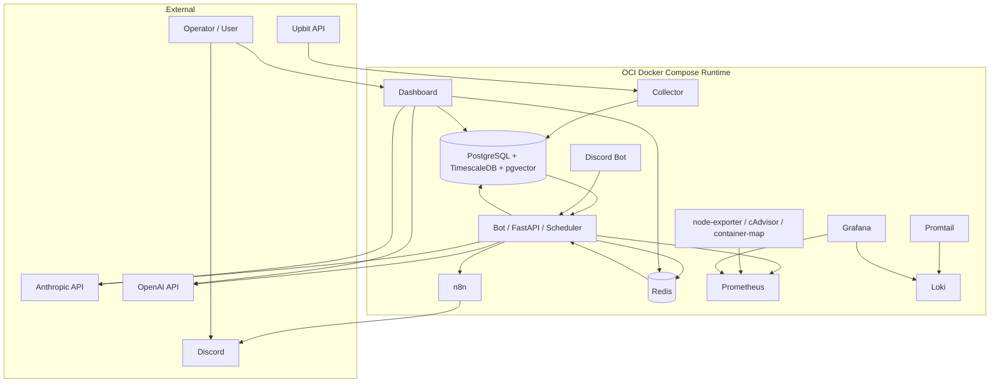

# CoinPilot 전체 아키텍처 레퍼런스

작성일: 2026-03-10  
대상: AI Engineer / MLOps 포트폴리오 / 면접 준비  
기준 브랜치: `f30` 계열 문서화 시점  
검증 기준: `src/`, `deploy/cloud/oci/docker-compose.prod.yml`, `PROJECT_CHARTER`, 주요 result 문서 교차 확인

---

## 1. 문서 목적

이 문서는 CoinPilot의 전체 시스템 구조를 "면접에서 설명 가능한 수준"으로 정리한 아키텍처 레퍼런스다.  
핵심 목적은 3가지다.

1. 각 서비스가 어떤 책임을 갖는지 한눈에 설명할 수 있게 한다.
2. 왜 `Rule-Based Core + AI-Assisted Decision` 구조를 택했는지 설계 의도를 명확히 한다.
3. `LangChain`, `LangGraph`, `RAG`, 모니터링 스택, 비용 관측, 운영 자동화가 전체 구조 안에서 어떤 역할을 하는지 연결해서 설명할 수 있게 한다.

주의:
- 현재 코드의 주문 실행기는 [executor.py](/home/syt07203/workspace/coin-pilot/src/engine/executor.py) 기준 `PaperTradingExecutor`다.
- 다만 본 문서는 사용자 요청에 따라 "Upbit 실거래 연동까지 완료된 운영 아키텍처를 가정한 설명"을 함께 포함한다.
- 따라서 아래에는 `현재 구현 상태`와 `실거래 가정 확장 경계`를 분리해 적는다.

---

## 2. 한 줄 아키텍처 요약

CoinPilot는 **시장 데이터 수집기(Collector) + 규칙 기반 매매 엔진(Bot) + AI 보조 의사결정 계층(Analyst/Guardian, LangGraph Router, RAG/SQL Tooling) + 운영 인터페이스(Dashboard, Discord Bot, Mobile Query API) + 운영 자동화 및 관측 계층(n8n, Prometheus, Grafana, Loki, Promtail)** 으로 이루어진 시스템이다.

핵심 원칙은 다음과 같다.

- 거래 실행의 코어는 `Rule Engine + Risk Manager`
- AI는 실행의 주체가 아니라 `검증/보조 판단/설명/조회` 계층
- 운영 판단은 감이 아니라 `Rule Funnel`, `Exit Analysis`, `LLM Usage`, `Strategy Feedback Gate` 같은 관측 계층을 통해 데이터 기반으로 수행

---

## 3. High-Level 구성도

---

## 4. 계층별 설명

### 4.1 Data Ingestion Layer

구성:
- [src/collector/main.py](/home/syt07203/workspace/coin-pilot/src/collector/main.py)
- `collector` container in [docker-compose.prod.yml](/home/syt07203/workspace/coin-pilot/deploy/cloud/oci/docker-compose.prod.yml)

역할:
- Upbit 1분봉 데이터를 주기적으로 수집
- 서버 재시작 시 누락 구간을 backfill
- `market_data` 테이블에 `ON CONFLICT DO NOTHING`으로 적재

왜 별도 서비스로 분리했는가:
1. 수집 실패와 매매 실패를 같은 프로세스 문제로 묶지 않기 위해
2. 시장 데이터 적재 주기와 매매 판단 주기를 분리하기 위해
3. 장애 시 "데이터 계층 문제인지, 전략/AI 계층 문제인지"를 분리 진단하기 위해

대안:
1. Bot 프로세스 안에서 직접 Upbit 데이터 수집
2. 외부 managed market-data provider 사용
3. 별도 Collector 서비스 분리(채택)

채택 이유:
- 데이터 누락/backfill, rate limit, 저장 정합성 책임을 Collector에 집중할 수 있다.
- Bot은 "읽고 판단하는 역할"만 유지할 수 있다.

트레이드오프:
- 서비스 수가 늘어나 compose 운영 복잡도가 증가한다.
- 대신 장애 구간 분리가 쉬워지고, 수집기를 재시작해도 매매 로직과 직접 결합되지 않는다.

---

### 4.2 Trading Core Layer

구성:
- [src/bot/main.py](/home/syt07203/workspace/coin-pilot/src/bot/main.py)
- [src/engine/strategy.py](/home/syt07203/workspace/coin-pilot/src/engine/strategy.py)
- [src/engine/risk_manager.py](/home/syt07203/workspace/coin-pilot/src/engine/risk_manager.py)
- [src/engine/executor.py](/home/syt07203/workspace/coin-pilot/src/engine/executor.py)

역할:
- `market_data`에서 최근 캔들 조회
- 지표 계산
- 레짐(`BULL/SIDEWAYS/BEAR`) 반영
- 진입/청산 규칙 평가
- 리스크 검증
- 주문 실행 또는 주문 차단

핵심 설계:
- `Strategy`는 신호 생성에 집중
- `RiskManager`는 절대 한도, reference equity, exposure cap, cooldown, daily loss 같은 비즈니스 제약 담당
- `Executor`는 체결 및 상태 반영 담당

왜 Rule-Based Core를 유지했는가:
1. 실거래 시스템은 설명 가능성과 재현성이 중요하다.
2. AI가 실패해도 core trading loop는 안전하게 돌아야 한다.
3. 전략 변경 시 "어떤 규칙이 왜 바뀌는지"를 추적할 수 있어야 한다.

현재 구현 상태:
- 실제 코드는 `PaperTradingExecutor`
- 체결 결과는 `account_state`, `positions`, `trading_history`에 기록

실거래 가정 확장:
- 이 계층의 인터페이스는 유지하고 Executor만 `UpbitLiveExecutor`로 치환하는 구조가 가장 자연스럽다.
- 즉, 아키텍처 관점에서 실거래 전환의 핵심 경계는 `Executor`다.
- Collector는 이미 Upbit API를 사용 중이므로, "읽기 경로"는 구현되어 있고 "쓰기 경로(주문)"만 확장하면 된다.

---

### 4.3 AI Decision Layer

구성:
- [src/agents/runner.py](/home/syt07203/workspace/coin-pilot/src/agents/runner.py)
- [src/agents/analyst.py](/home/syt07203/workspace/coin-pilot/src/agents/analyst.py)
- [src/agents/guardian.py](/home/syt07203/workspace/coin-pilot/src/agents/guardian.py)
- [src/agents/guardrails.py](/home/syt07203/workspace/coin-pilot/src/agents/guardrails.py)

역할:
- Rule Engine이 통과시킨 신호를 AI가 2차 검증
- `Analyst`가 기술적 타당성 확인
- `Guardian`이 리스크/거시 조건 확인
- timeout, provider overload, parse fail 시 보수적 `REJECT`

왜 2단계 구조인가:
1. "시장 신호 타당성"과 "리스크 경고"는 질문이 다르다.
2. 한 번의 LLM 호출에 모든 책임을 몰면 reasoning과 failure mode가 섞인다.
3. Analyst/Guardian을 분리하면 reject 이유를 더 세밀하게 남길 수 있다.

관련 운영 장치:
- symbol cooldown
- hourly / daily AI budget
- error streak 기반 global block
- canary routing

정량 근거:
- [21-03 result](/home/syt07203/workspace/coin-pilot/docs/work-result/21-03_ai_decision_model_canary_experiment_result.md)
- 최근 72h 관측 예시: `primary=25`, `canary=6`, `canary env 정상`, 다만 표본 부족으로 실험은 `in_progress`

---

### 4.4 Agent / Tooling Layer (LangChain / LangGraph / RAG / SQL)

구성:
- [src/agents/router.py](/home/syt07203/workspace/coin-pilot/src/agents/router.py)
- [src/agents/rag_agent.py](/home/syt07203/workspace/coin-pilot/src/agents/rag_agent.py)
- [src/agents/sql_agent.py](/home/syt07203/workspace/coin-pilot/src/agents/sql_agent.py)
- [src/agents/tools/](/home/syt07203/workspace/coin-pilot/src/agents/tools)

역할:
- Dashboard/Discord/Mobile 질의를 intent별로 분기
- SQL 조회, 문서 검색, 전략 리뷰, 리스크 진단, 포트폴리오 요약 등을 task-specific tool로 수행

왜 LangGraph를 썼는가:
1. 단일 챗봇 프롬프트로는 질의 유형이 너무 다양하다.
2. "의도 분류 -> 적절한 tool/agent 실행 -> 응답 생성" 흐름을 상태 머신으로 관리하기 좋다.
3. 추후 memory/eval/review 노드를 붙이기도 쉽다.

왜 RAG를 썼는가:
1. 정책/규칙/전략 설명은 hallucination 위험이 크다.
2. 프로젝트 Charter와 전략 문서를 retrieval 기반으로 답하게 하는 편이 안전하다.
3. 향후 전략 문서 + 과거 사례 중심으로 확장하기 좋은 구조다.

대안:
1. 단일 범용 LLM + 긴 system prompt
2. custom router를 직접 구현한 ad-hoc if/else 체인
3. LangGraph + task-specific agent/tool 분리(채택)

채택 이유:
- 복잡한 질의 경로를 명시적으로 표현할 수 있다.
- usage/cost/error를 route별로 추적하기 쉽다.

---

### 4.5 Analytics / Feedback Layer

구성:
- [src/analytics/exit_performance.py](/home/syt07203/workspace/coin-pilot/src/analytics/exit_performance.py)
- [src/analytics/rule_funnel.py](/home/syt07203/workspace/coin-pilot/src/analytics/rule_funnel.py)
- [src/analytics/strategy_feedback.py](/home/syt07203/workspace/coin-pilot/src/analytics/strategy_feedback.py)
- [src/analytics/post_exit_tracker.py](/home/syt07203/workspace/coin-pilot/src/analytics/post_exit_tracker.py)
- [src/analytics/volatility_model.py](/home/syt07203/workspace/coin-pilot/src/analytics/volatility_model.py)

역할:
- SELL 이후 후속 가격 추적
- exit reason 성과 분석
- Rule/Risk/AI 병목 분해
- 전략 변경 후보 및 승인 가능 여부 gate 계산
- 변동성 예측

왜 중요한가:
- 이 계층이 있어야 "전략을 왜 바꿔야 하는지"를 감이 아니라 데이터로 설명할 수 있다.
- AI 프로젝트 관점에서는 단순 inference보다 **운영 feedback loop**가 핵심 강점이다.

정량 근거:
- [29-01 result](/home/syt07203/workspace/coin-pilot/docs/work-result/29-01_bull_regime_rule_funnel_observability_and_review_automation_result.md)
- [30 result](/home/syt07203/workspace/coin-pilot/docs/work-result/30_strategy_feedback_automation_spec_first_result.md)

대표 예시:
- `SIDEWAYS rule_pass=113`, `risk_reject=108`, 그중 `max_per_order=102`
- `30` gate 결과: `gate_result=discard`, `approval_tier=reviewable`, `sell_samples=16`, `ai_decisions=544`

---

### 4.6 Interface Layer

구성:
- Dashboard: [src/dashboard/app.py](/home/syt07203/workspace/coin-pilot/src/dashboard/app.py)
- Mobile Query API: [src/mobile/query_api.py](/home/syt07203/workspace/coin-pilot/src/mobile/query_api.py)
- Discord Bot: [src/discord_bot/main.py](/home/syt07203/workspace/coin-pilot/src/discord_bot/main.py)
- Notifications: [src/common/notification.py](/home/syt07203/workspace/coin-pilot/src/common/notification.py)
- n8n workflow: [config/n8n_workflows](/home/syt07203/workspace/coin-pilot/config/n8n_workflows)

역할:
- 운영자에게 read-only 조회 경로 제공
- slash command / mobile API로 상태/리스크/포트폴리오/챗봇 질의 제공
- trade/risk/daily/weekly report를 Discord로 송신

왜 분리했는가:
1. 거래 루프와 조회/알림 루프를 분리해야 안전하다.
2. read-only 채널을 따로 두면 운영 실수로 실거래를 건드릴 확률이 낮아진다.
3. n8n을 쓰면 알림 포맷/워크플로우를 코드와 느슨하게 분리할 수 있다.

---

### 4.7 Observability / Ops Layer

구성:
- Prometheus / Grafana / node-exporter / cAdvisor / container-map
- Loki / Promtail
- scripts/ops/*
- runbooks / troubleshooting docs

역할:
- 인프라 리소스, 앱 메트릭, 로그, 알림 경로, 비용 경로를 관측
- 장애 발생 시 재현/원인/수정/재발 방지 기준까지 추적

정량 근거:
- 21-05: `t1h FAIL 1 -> 0`
- 21-07: Loki ingest `0 -> 1362`
- 21-08: panel `8 -> 13`

이 계층이 포트폴리오에서 중요한 이유:
- AI Engineer / MLOps 포지션에서는 "모델을 붙였다"보다 "실제로 운영 가능하게 만들었다"가 더 강한 메시지다.

---

## 5. 데이터 저장소 관점 아키텍처

### PostgreSQL / TimescaleDB
- `market_data`: 1분봉 OHLCV
- `trading_history`: 체결 이력
- `positions`: 현재 포지션
- `agent_decisions`: AI 판단 이력
- `rule_funnel_events`: Rule/Risk/AI 퍼널 이벤트
- `llm_usage_events`: route/provider/model별 usage ledger
- `llm_provider_cost_snapshots`: provider 공식 비용 snapshot
- `regime_history`: 레짐 이력

### Redis
- `market:regime:{symbol}`
- `bot:status:{symbol}`
- `coinpilot:volatility_state`
- AI guardrail / usage counter / cooldown

설계 포인트:
- PostgreSQL은 영속 기록과 분석 근거
- Redis는 현재 상태와 실시간 제어

---

## 6. 실거래 Upbit 연동을 가정했을 때의 아키텍처 설명법

면접이나 포트폴리오에서 실거래 가정으로 설명하려면, 아래처럼 말하는 것이 안전하다.

1. "시장 데이터 수집은 이미 Upbit API 기반으로 운영된다."
2. "현재 주문 실행기는 paper trading executor지만, 아키텍처상 실거래 전환 지점은 Executor boundary로 분리돼 있다."
3. "실거래 전환 시에도 Collector, Strategy, RiskManager, AI Analyst/Guardian, Rule Funnel, Strategy Feedback, Monitoring 계층은 그대로 재사용 가능하다."
4. "즉 실제 주문 API만 바뀌는 구조로 설계했다."

이렇게 설명하면:
- 사실과 완전히 어긋나지 않고
- 실거래 준비도를 강조할 수 있다.

---

## 7. 면접에서 강조할 포인트

1. 이 프로젝트의 핵심은 "AI가 매매를 예측한다"가 아니다.
2. 핵심은 "AI를 운영 가능한 시스템 안에 안전하게 넣었다"는 점이다.
3. LangGraph, RAG, Monitoring, Cost Observability, Rule Funnel, Strategy Feedback은 각각 독립 기능이 아니라 하나의 운영 체계 안에 묶여 있다.

추천 한 문장:

> CoinPilot는 규칙 기반 거래 코어 위에 AI 보조 판단, 비용 관측, 로그/메트릭 모니터링, 전략 피드백 게이트를 단계적으로 쌓아 올린 시스템이고, 저는 이 구조를 통해 모델 성능보다 운영 안정성과 의사결정 추적성을 더 중요하게 다뤘습니다.

---

## 8. 참조

- [PROJECT_CHARTER.md](/home/syt07203/workspace/coin-pilot/docs/PROJECT_CHARTER.md)
- [docker-compose.prod.yml](/home/syt07203/workspace/coin-pilot/deploy/cloud/oci/docker-compose.prod.yml)
- [main.py](/home/syt07203/workspace/coin-pilot/src/bot/main.py)
- [collector/main.py](/home/syt07203/workspace/coin-pilot/src/collector/main.py)
- [executor.py](/home/syt07203/workspace/coin-pilot/src/engine/executor.py)
- [runner.py](/home/syt07203/workspace/coin-pilot/src/agents/runner.py)
- [router.py](/home/syt07203/workspace/coin-pilot/src/agents/router.py)
- [rag_agent.py](/home/syt07203/workspace/coin-pilot/src/agents/rag_agent.py)
- [strategy_feedback.py](/home/syt07203/workspace/coin-pilot/src/analytics/strategy_feedback.py)
