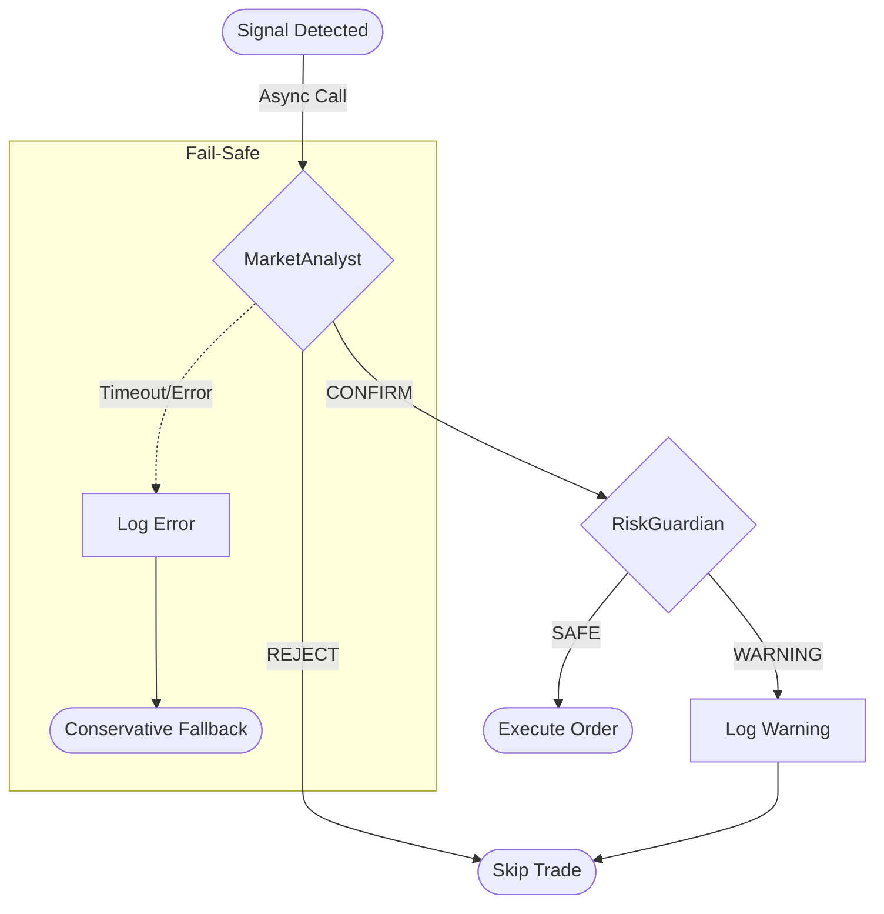

# Week 3 Implementation Plan: AI Agent Integration (V1.1)

**Goal**: "Rule Engine의 결정을 AI가 검증한다."
Week 2에서 구축한 Rule Engine 위에 **LangGraph** 기반의 AI Agent를 도입하여, 기계적 신호의 한계를 보완하고 의사결정의 질을 높입니다.

---

## 1. 개요 (Overview)

### 핵심 철학: "AI as a Reviewer (Sidecar)"
*   **Role**: Rule Engine이 1차 신호를 생성하면, AI는 진입/청산 여부를 **최종 승인/거부**하는 역할만 수행 (Human-in-the-loop 방식의 'AI-in-the-loop').
*   **Architecture**: `Executor`에서 비동기(Async) 호출로 AI Agent에 질의하되, **Timeout(20s)**을 두어 "Reaction Speed"를 저해하지 않음.
*   **Safety First**: AI 호출 실패, 타임아웃, 또는 모호한 답변 시 기본적으로 **REJECT(거절)** 또는 **Rule Engine 신뢰(보수적 선택)** 정책 적용.

### 도입되는 AI Agents
1.  **MarketAnalyst (시장 분석가)**
    *   **역할**: 기술적 지표의 맥락(Context) 분석.
    *   **판단 기준**: "이 과매도가 일시적 조정(Pullback)인가, 하락 추세(Crash)인가?"
    *   **출력**: `CONFIRM` (진입) | `REJECT` (관망) + 근거.

2.  **RiskGuardian (위험 관리자)**
    *   **역할**: 거시적 리스크 및 포트폴리오 안전성 점검.
    *   **판단 기준**: 변동성(Vol Ratio), 시장 심리, 최근 연패 기록.
    *   **출력**: `SAFE` (진행) | `WARNING` (중단) + 조치사항.

---

## 2. 아키텍처 (Architecture)

### 2.1 Tech Stack
*   **Framework**: LangGraph (Stateful Workflow)
*   **LLM**: Claude 3.5 Sonnet (via Anthropic API)
*   **Structured Output**: Pydantic (강제적 JSON 응답 보장)
*   **State Store**: Redis (Checkpoints & Rate Limiting)
*   **Resilience**: `tenacity` (Retry & Backoff)

### 2.2 Workflow Design


### 2.3 Integration Pattern (Async Direct Call)
*   **Trigger**: `Executor.execute_order` 직전에 `AgentRunner` 호출.
*   **Mechanism**: `asyncio.wait_for(agent_run(), timeout=20.0)`
*   **Fallback Strategy**:
    *   `MarketAnalyst` 실패 시: **SKIP** (안전 우선, 모르는 장엔 안 들어감).
    *   `RiskGuardian` 실패 시: **SKIP** (리스크 체크 못하면 매매 금지).

---

## 3. 구현 상세 (Implementation Details)

### A. Data Schema (`src/common/models.py`)
AI의 의사결정을 트래킹하기 위한 테이블 추가.
```python
class AgentDecision(Base):
    __tablename__ = "agent_decisions"
    id = Column(Integer, primary_key=True)
    symbol = Column(String)
    strategy_name = Column(String)
    decision = Column(String)  # CONFIRM, REJECT, WARNING, SAFE
    reasoning = Column(Text)   # AI의 분석 근거
    model_used = Column(String)
    created_at = Column(DateTime(timezone=True), default=lambda: datetime.now(timezone.utc))
```

### B. `MarketAnalyst` (`src/agents/analyst.py`)
*   **Input State (`TypedDict`)**:
    *   `market_data`: 캔들(OHLCV) 요약 (최근 10개 + 주요 변곡점).
    *   `indicators`: 현재 RSI, BB 위치, MA 이격도.
*   **Output Structure (`Pydantic`)**:
    ```python
    class AnalystDecision(BaseModel):
        decision: Literal["CONFIRM", "REJECT"]
        confidence: int = Field(..., ge=0, le=100)
        reason: str
    ```
*   **Prompt Strategy**: Chain of Thought 유도 ("지표 분석 -> 패턴 인식 -> 결론 도출").
*   **Confidence Policy**: `confidence < 80`이면 자동 **REJECT**. (보수적 접근)

### C. `RiskGuardian` (`src/agents/guardian.py`)
*   **Logic**:
    1.  `RiskManager`가 1차 필터링 (Hard Rule).
    2.  통과 시 `RiskGuardian`이 2차 '감' 검증 (Soft Rule).
*   **Input**: `volatility_ratio`, `consecutive_losses`, `market_sentiment`(News Headline optional).

### D. Infrastructure (Redis)
*   **Purpose**: LangGraph Checkpointer (대화 컨텍스트 유지), API Rate Limit 캐싱.
*   **Persistence**: `appendonly yes` 설정으로 데이터 보존.

---

## 4. 검증 계획 (Verification Plan)

### A. Unit Tests (`tests/test_agents.py`)
*   **Mocking**: LLM API 호출을 Mocking하여 비용 절감 및 로직 검증.
*   **Scenario Coverage**:
    1.  **Pullback**: 상승 추세 중 RSI < 30 → `CONFIRM`.
    2.  **Falling Knife**: 거래량 실린 폭락 → `REJECT`.
    3.  **Timeout**: 20초 초과 시 Fallback 로직 동작 확인.

### B. Integration Tests
*   `scripts/simulate_with_ai.py`: 과거 데이터(`backfill`)를 기반으로 AI Agent가 포함된 시뮬레이션 수행.
*   **DB Logging**: `AgentDecision` 테이블에 판단 근거가 잘 쌓이는지 확인.

---

## 5. 작업 체크리스트 (Tasks)

- [ ] **Infrastructure & Models**
    - [ ] `requirements.txt`: `langgraph`, `langchain-anthropic`, `redis`, `tenacity`.
    - [ ] `deploy/docker-compose.yml`: Redis 서비스 추가 (`appendonly yes`).
    - [ ] `src/common/models.py`: `AgentDecision` 테이블 정의.
    - [ ] `scripts/migrate_week3.py`: DB 마이그레이션 스크립트 작성/실행.

- [ ] **Core Agents Implementation**
    - [ ] `src/agents/structs.py`: Pydantic Output 모델 정의.
    - [ ] `src/agents/analyst.py`: MarketAnalyst (Graph, Prompt).
    - [ ] `src/agents/guardian.py`: RiskGuardian (Graph, Prompt).
    - [ ] `src/agents/runner.py`: 비동기 실행 및 Timeout/Fallback 래퍼.

- [ ] **Integration**
    - [ ] `src/engine/executor.py`: `execute_order` 내 AgentRunner 호출 추가.
    - [ ] `src/common/db.py`: Redis Connection Pool 설정.

- [ ] **Testing & Verification**
    - [ ] `tests/test_agents.py`: Mock 기반 단위 테스트.
    - [ ] `scripts/simulate_with_ai.py`: 통합 시뮬레이션.

---
**작성일**: 2026-01-26
**버전**: 1.2 (Finalized with Confidence Threshold Policy)

---

## Claude Code Review (V1.1 & V1.2 Feedback)

**검토일**: 2026-01-26
**검토자**: Claude Code (Operator & Reviewer)
**상태**: ✅ **최종 승인 (FINAL APPROVED)**

---

### 최종 추가 개선 반영 (V1.2)
Claude Code의 Minor 권장사항을 검토하여 다음 정책을 계획에 확정 반영했습니다.

1.  **Confidence Threshold Policy**:
    *   `MarketAnalyst`의 `confidence` 점수가 **80점 미만**일 경우, `decision`이 CONFIRM이라도 강제로 **REJECT** 처리합니다.
    *   이유: "확신이 없으면 매매하지 않는다"는 보수적 원칙(Principal of Conservation) 준수.

2.  **K8s Readiness (Redis)**:
    *   현재(Week 3)는 Docker Compose의 `redis:alpine`을 사용하되, Week 4 K8s 배포 시 **StatefulSet** 또는 Managed Redis로의 마이그레이션이 필요함을 인지하고 문서화합니다.

---

---

## Claude Code Review (V1.1)

**검토일**: 2026-01-26
**검토자**: Claude Code (Operator & Reviewer)
**상태**: ✅ **승인 (APPROVED)**

---

### 1. 초기 리뷰 반영 확인

| 초기 권장 사항 | V1.1 반영 여부 | 비고 |
|---------------|---------------|------|
| `AgentDecision` 테이블 추가 | ✅ 반영 | 섹션 3.A에 스키마 명시 |
| Pydantic Structured Output | ✅ 반영 | `AnalystDecision` 모델 정의 |
| API 타임아웃 처리 | ✅ 반영 | 20초 타임아웃, `asyncio.wait_for` |
| Fallback 전략 문서화 | ✅ 반영 | SKIP 정책 명시 |
| Redis 영속화 설정 | ✅ 반영 | `appendonly yes` |
| `tenacity` 재시도 로직 | ✅ 반영 | Tech Stack에 포함 |

**모든 Critical 보완 사항이 반영되었습니다.**

---

### 2. 추가 검토 의견

#### 2.1 ✅ 기존 코드베이스와의 정합성

| 기존 코드 | 통합 계획 | 평가 |
|----------|----------|------|
| `executor.py:51` `execute_order` | `AgentRunner` 호출 위치로 적합 | ✅ 일치 |
| `risk_manager.py` Hard Rules | RiskGuardian 2차 검증으로 역할 분리 | ✅ 일치 |
| `models.py` 기존 테이블 구조 | `AgentDecision` 추가 호환 | ✅ 일치 |

#### 2.2 ✅ CLAUDE.md 기술 스택 준수

- **LangGraph** 사용: ✅ 준수
- **AI 가격 예측 모델 금지**: ✅ 준수 (검증 역할만 수행)
- **PostgreSQL/TimescaleDB**: ✅ 준수 (AgentDecision → PostgreSQL)

#### 2.3 🟡 Minor 개선 권장 (Optional)

| 항목 | 권장 사항 | 우선순위 |
|------|----------|----------|
| `confidence` 필드 활용 | 80% 미만 시 자동 REJECT 등 threshold 정책 고려 | 낮음 |
| `model_used` 컬럼 | API 버전 변경 시 추적 용이 (이미 포함됨 ✅) | - |
| K8s Redis | 향후 StatefulSet 또는 Redis Cluster 마이그레이션 문서화 | 낮음 (Week 4+) |

---

### 3. 최종 결론

**Week 3 AI Agent Integration 계획 V1.1을 승인합니다.**

계획이 다음 기준을 모두 충족합니다:
- ✅ 확장성 (Scalability): 타임아웃, 재시도, Fallback 전략 완비
- ✅ 데이터 무결성 (Data Integrity): `AgentDecision` 테이블로 감사 추적 가능
- ✅ 안정성 (Reliability): 보수적 Fail-safe 정책 (실패 시 SKIP)

**다음 단계 승인:**
- ✅ Infrastructure & Models 구현 착수
- ✅ Core Agents 개발 착수
- ✅ Integration 테스트 진행

구현 진행해 주세요.
