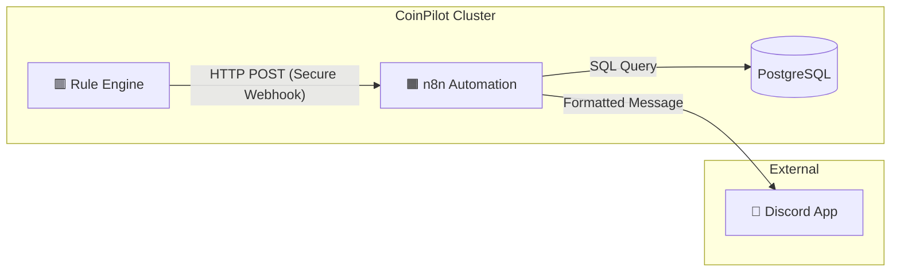

# Week 5: Notification System (n8n + Discord) Implementation Plan

**Date**: 2026-01-29
**Author**: [Hur Youchan]
**Status**: Revised (v2)

---

## 1. 개요 (Overview)

Week 5의 목표는 **"사용자가 시스템을 항상 보고 있지 않아도 상태를 알 수 있게 하는 것"**입니다.
확장성과 유연성이 뛰어난 노코드(No-Code) 자동화 툴인 **n8n**을 Kubernetes 클러스터에 배포하고, **Discord Webhook**을 통해 주요 이벤트를 실시간으로 전송합니다.

### 1.1 목표 (Goals)
1.  **Observable**: 매매 체결 및 리스크 상황을 실시간으로 파악.
2.  **Reportable**: 하루 동안의 성과를 요약하여 받아봄.
3.  **Decoupled**: 매매 엔진과 알림 로직을 분리(Webhook 방식)하여 엔진의 성능 저하 방지.

### 1.2 범위 (Scope)
-   **Infrastructure**: n8n Deployment (with Resources/Liveness), Service, PVC.
-   **Integration**: Discord Server & Webhook Configuration.
-   **Workflows**:
    1.  📈 **Trade Executed**: 매수/매도 체결 시 즉시 알림.
    2.  ⚠️ **Risk Alert**: 손실 한도 근접 등 위험 상황 시 즉시 알림.
    3.  📊 **Daily Report**: 매일 09:00 (KST) 전일 성과 요약 발송.

---

## 2. 아키텍처 (Architecture)



### 2.1 데이터 흐름
1.  **Event-Driven (Trade/Risk)**: Engine이 n8n Webhook URL로 JSON 데이터를 POST합니다. (Header Auth)
2.  **Schedule-Driven (Daily)**: n8n 내부 Cron Trigger가 실행되면 DB에서 데이터를 조회(Pull)하여 메시지를 생성합니다.

---

## 3. 상세 구현 계획 (Step-by-Step)

### Phase 1: n8n on Kubernetes (Secure Configuration)
n8n을 코인파일럿 클러스터의 일원으로 배포합니다. 

-   **Files to Create**:
    -   `k8s/apps/n8n-deployment.yaml`: Deployment, Service, PVC.
-   **Configuration**:
    -   **Webhook Secret**: `k8s/base/secret.yaml`에 `N8N_WEBHOOK_SECRET` 추가.
    -   **DB**: `DB_TYPE=sqlite` (초기 구성 간소화).
    -   **Resources & Probes**:
        ```yaml
        resources:
          requests:
            memory: "256Mi"
            cpu: "100m"
          limits:
            memory: "512Mi"
            cpu: "500m"
        livenessProbe:
          httpGet:
            path: /healthz
            port: 5678
          initialDelaySeconds: 30
          periodSeconds: 10
        ```

### Phase 2: Discord & Security Integration
사용자가 Discord 서버를 생성하고 Webhook URL을 발급받습니다.

-   **Action**:
    -   Discord 서버 개설 (이미 있다면 생략).
    -   채널 생성: `#coinpilot-bot` (단일 채널로 시작).
    -   Webhook URL 생성 -> `k8s/base/secret.yaml`에 등록.

### Phase 3: Workflow Automation
n8n UI에서 3가지 워크플로우를 구현합니다.

#### A. Trade Execution Workflow
-   **Trigger**: Webhook (POST `/webhook/trade`)
    -   **Auth**: Header `X-Webhook-Secret` 검증.
-   **Input Data**:
    ```json
    { "symbol": "KRW-BTC", "side": "BUY", "price": 100000000, "quantity": 0.001, ... }
    ```
-   **Code Integration**:
    -   `src/engine/executor.py`: 주문 성공 후 비동기 호출. (Retry Logic 포함)

#### B. Risk Alert Workflow
-   **Trigger**: Webhook (POST `/webhook/risk`)
    -   **Auth**: Header `X-Webhook-Secret` 검증.
-   **Input Data**: `{"type": "LOSS_LIMIT", "message": "Daily loss -4.8% reached!"}`
-   **Code Integration**:
    -   `src/engine/risk_manager.py`: 리스크 위반 시 호출.

#### C. Daily Report Workflow
-   **Trigger**: Cron (Every day at 00:00 UTC = 09:00 KST)
-   **Logic**:
    -   **Corrected SQL**:
        ```sql
        SELECT * FROM trading_history
        WHERE created_at >= (CURRENT_DATE - INTERVAL '1 day') AT TIME ZONE 'UTC'
          AND created_at < CURRENT_DATE AT TIME ZONE 'UTC'
        ```
    -   Calculate: 총 수익률, 매매 횟수, 승률.
-   **Output**: Discord Message (Summary Embed).

### Phase 4: Error Handling Strategy
-   **Engine -> n8n**: `httpx` 라이브러리를 사용하여 타임아웃(2s) 및 재시도(3회) 설정.
-   **n8n -> Discord**: n8n의 `Error Trigger` 노드를 사용하여 전송 실패 시 로그 기록.
-   **Fallback**: 치명적 오류 발생 시 K8s 로그(`kubectl logs`)에 기록하여 모니터링 시스템(Prometheus)이 감지.

---

## 4. 검증 계획 (Verification)

### 4.1 인프라 검증
-   `kubectl get pods`로 n8n 실행 및 liveness probe 통과 확인.
-   `localhost:5678` 접속 확인.

### 4.2 알림 테스트
-   **Manual (with Auth)**:
    ```bash
    curl -X POST http://localhost:5678/webhook/trade \
      -H "X-Webhook-Secret: <SECRET>" \
      -H "Content-Type: application/json" \
      -d '{"symbol":"KRW-BTC", "side":"BUY", "price":1000, "quantity":1}'
    ```
-   **Integration**: `simulation_with_ai.py` 실행 시 실제 매매 이벤트 발생 및 알림 도착 확인.

---

## 5. Decision Log (Review Feedback Applied)
-   [x] **n8n DB**: **SQLite + PVC**로 결정 (Review Approved).
-   [x] **Discord Channel**: **#coinpilot-bot** 단일 채널로 결정 (Review Approved).
-   [x] **SQL Correction**: `trading_history` 테이블 및 UTC Timestamp 쿼리로 수정 완료.
-   [x] **Security**: `X-Webhook-Secret` 헤더 인증 도입.
-   [x] **K8s Ops**: Resource Limits 및 Liveness/Readiness Probe 추가.

---

## Claude Code Review - Final Approval

**Reviewer**: Claude Code (Operator & Reviewer)
**Date**: 2026-01-29
**Status**: ✅ **APPROVED**

### Review Summary

| 항목 | 상태 | 비고 |
|------|------|------|
| SQL Query (Data Integrity) | ✅ Fixed | `trading_history`, `created_at` UTC 범위 쿼리 |
| Webhook Security | ✅ Fixed | `X-Webhook-Secret` 헤더 인증 |
| K8s Best Practices | ✅ Fixed | Resource limits, Liveness probe |
| Error Handling | ✅ Added | Phase 4 전략 문서화 |
| Code Integration Points | ✅ Added | `executor.py`, `risk_manager.py` 명시 |

### Implementation Notes (참고사항)

구현 시 아래 사항 참고:

1. **n8n → PostgreSQL 연결**: n8n Credentials에서 PostgreSQL 노드 설정 시 K8s 내부 DNS 사용
   ```
   Host: db (K8s Service Name)
   Port: 5432
   Database: coinpilot
   ```

2. **readinessProbe 추가 권장**: livenessProbe와 함께 readinessProbe도 설정하면 배포 안정성 향상
   ```yaml
   readinessProbe:
     httpGet:
       path: /healthz
       port: 5678
     initialDelaySeconds: 5
     periodSeconds: 5
   ```

3. **승률(Win Rate) 계산 로직**: Daily Report에서 승률 계산 시, 매수→매도 페어링 필요. 구현 단계에서 상세 로직 정의 필요.

### Approval

모든 Critical/Medium 이슈가 해결되었습니다. 계획대로 구현을 진행해도 좋습니다.

```
┌─────────────────────────────────────┐
│  ✅ APPROVED FOR IMPLEMENTATION     │
│                                     │
│  Reviewer: Claude Code              │
│  Date: 2026-01-29                   │
└─────────────────────────────────────┘
```
