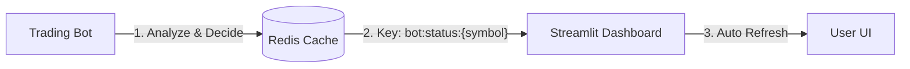

# Feature Plan: Bot Reasoning Visualization ("Bot Brain")

**Date**: 2026-01-30
**Target**: Provide real-time visibility into the Bot's decision-making process.

---

## 1. 개요 (Overview)
현재 봇은 백그라운드에서 조용히 실행되므로, 매매가 없을 때 사용자는 "봇이 멈춘 건지" 아니면 "조건이 안 맞아서 기다리는 건지" 알 수 없습니다.
이를 해결하기 위해 봇의 **내부 상태(Indicators)와 판단 근거(Reasoning)**를 실시간으로 대시보드에 시각화합니다.

## 2. 아키텍처 (Architecture)



-   **데이터 흐름**: Bot (Producer) -> Redis -> Dashboard (Consumer)
-   **Redis Key**: `bot:status:KRW-BTC` (JSON format, TTL 5분)

## 3. 구현 상세 (Implementation Details)

### 3.1 Bot (`src/bot/main.py`)
봇 루프 내에서 의사결정 로직 수행 직후, `build_status_reason` 함수를 통해 상태를 요약하고 Redis에 저장합니다.

#### A. Reason 생성 로직 (Logic)
```python
def build_status_reason(indicators, pos, risk_valid, risk_reason):
    if pos:
        return f"포지션 보유 중 (진입가: {pos['avg_price']:,.0f})"
    if not risk_valid:
        return f"거래 제한: {risk_reason}"

    rsi = indicators.get("rsi", 0)
    if rsi > 30:
        return f"RSI({rsi:.1f}) > 30, 과매도 아님. 대기 중..."
    return "진입 조건 충족, AI 검증 대기"
```

#### B. Redis 데이터 구조 (Schema)
TTL은 **5분(300초)**로 설정하여 봇 다운 시 데이터가 자연스럽게 만료되도록 합니다.
```json
{
  "timestamp": "2026-01-30T12:00:00Z",
  "symbol": "KRW-BTC",
  "current_price": 95000000,
  "indicators": {
    "rsi": 45.2,
    "bb_lower": 94500000,
    "ma_200": 93000000
  },
  "position": {
    "has_position": false,
    "avg_price": null
  },
  "action": "HOLD",
  "reason": "RSI(45.2) > 30, 과매도 아님. 대기 중..."
}
```

### 3.2 Dashboard (`src/dashboard/pages/2_market.py`)
`Market Analysis` 페이지 상단에 Expander 형태로 상태를 표시합니다. `5_system.py`와 유사하게 동기 Redis 클라이언트를 사용합니다.

#### A. Redis Client (Sync)
```python
def get_bot_status(symbol: str) -> dict:
    try:
        r = redis.Redis(host=REDIS_HOST, port=REDIS_PORT, decode_responses=True)
        data = r.get(f"bot:status:{symbol}")
        return json.loads(data) if data else None
    except:
        return None
```

#### B. UI Components
-   **Expander**: "🤖 Bot Brain (Live Status)"
-   **Metrics**: Action, RSI, Last Update (Freshness)
-   **Info Box**: Reason (봇의 판단 근거)
-   **Freshness Warning**: 업데이트가 2분 이상 지연되면 경고 표시.


## 4. 작업 단계 (Tasks)

1.  **[Bot] Redis Publisher 구현**:
    -   `src/bot/main.py`에 `common.db.get_redis_client` 활용하여 상태 저장 로직 추가.
2.  **[Dash] UI Component 구현**:
    -   `src/dashboard/pages/2_market.py`에 Redis 조회 및 시각화 코드 추가.
3.  **[Ops] Verification**:
    -   봇 재배포 (`kubectl rollout restart`)
    -   대시보드에서 실시간 업데이트 확인.

---

## 5. 기대 효과
-   사용자는 봇이 **살아있음**을 확신할 수 있음.
-   매매가 안 일어나는 **논리적 이유**를 즉시 파악 가능.

---

## 6. Claude Code Review

### Review #1 (Initial)
**Date**: 2026-01-30
**Status**: 보완 요청 → 피드백 반영 완료

---

### Review #2 (Final)
**Reviewer**: Claude Code (Opus 4.5)
**Date**: 2026-01-30
**Status**: ✅ **APPROVED**

#### 피드백 반영 확인

| 권장 사항 | 반영 위치 | 상태 |
|----------|----------|------|
| Reason 생성 로직 구체화 | §3.1.A `build_status_reason()` | ✅ |
| Redis JSON 스키마 명세 | §3.1.B 데이터 구조 | ✅ |
| 대시보드 Redis 클라이언트 | §3.2.A 동기 클라이언트 코드 | ✅ |
| TTL 전략 | §3.1.B "TTL 5분" 명시 | ✅ |
| UI Components 상세 | §3.2.B Expander, Metrics, Freshness | ✅ |

---

**최종 승인: 구현 진행 가능**

---

### 기획 정합성 검증

#### A. 봇 코드 분석 (`src/bot/main.py`)

| 항목 | 현재 상태 | 기획 요구사항 | 일치 여부 |
|------|----------|--------------|----------|
| **메인 루프** | `bot_loop()` 존재 (1분 주기) | 루프 내 상태 저장 | ✅ 가능 |
| **지표 계산** | `get_all_indicators(df)` 사용 | RSI 등 저장 필요 | ✅ 이미 계산됨 |
| **포지션 정보** | `executor.get_position()` | position 저장 | ✅ 가능 |
| **결정 이유** | 부분적 존재 (`exit_reason`, `risk_reason`) | reason 필드 | ⚠️ 통합 로직 필요 |
| **Redis 클라이언트** | `common.db.get_redis_client` (비동기) | 상태 저장용 | ✅ 사용 가능 |

#### B. 대시보드 코드 분석

| 항목 | 현재 상태 | 기획 요구사항 | 주의사항 |
|------|----------|--------------|----------|
| **Redis 조회** | 동기 방식 필요 | `2_market.py`에 추가 | ⚠️ `redis.Redis` (동기) 사용 필요 |
| **Auto Refresh** | `streamlit-autorefresh` 적용됨 | 실시간 업데이트 | ✅ 호환 |

---

### 보완 권장 사항

#### 1. Reason 생성 로직 구체화

현재 봇 코드에서 reason이 산발적으로 존재합니다. 통합 로직 필요:

```python
# 제안: bot_loop() 내 Step 2 이후에 추가
def build_status_reason(indicators, pos, risk_valid, risk_reason):
    if pos:
        return f"포지션 보유 중 (진입가: {pos['avg_price']:,.0f})"
    if not risk_valid:
        return f"거래 제한: {risk_reason}"

    rsi = indicators.get("rsi", 0)
    if rsi > 30:
        return f"RSI({rsi:.1f}) > 30, 과매도 아님. 대기 중..."
    return "진입 조건 충족, AI 검증 대기"
```

#### 2. Redis 데이터 구조 명세 추가

기획서에 JSON 스키마 명시 권장:

```json
{
  "timestamp": "2026-01-30T12:00:00Z",
  "symbol": "KRW-BTC",
  "current_price": 95000000,
  "indicators": {
    "rsi": 45.2,
    "bb_lower": 94500000,
    "bb_upper": 96000000,
    "ma_200": 93000000
  },
  "position": {
    "has_position": false,
    "avg_price": null,
    "quantity": null
  },
  "action": "HOLD",
  "reason": "RSI(45.2) > 30, 과매도 아님. 대기 중..."
}
```

#### 3. 대시보드 Redis 연결 방식

`5_system.py`에서 이미 동기 Redis 연결을 사용하고 있으므로 패턴 재사용 권장:

```python
# 2_market.py에서 사용할 수 있는 패턴
import redis
import json

REDIS_HOST = os.getenv("REDIS_HOST", "localhost")
REDIS_PORT = int(os.getenv("REDIS_PORT", "6379"))

def get_bot_status(symbol: str) -> dict:
    try:
        r = redis.Redis(host=REDIS_HOST, port=REDIS_PORT, decode_responses=True)
        data = r.get(f"bot:status:{symbol}")
        return json.loads(data) if data else None
    except:
        return None
```

#### 4. TTL 및 Freshness 전략

| 항목 | 권장값 | 이유 |
|------|--------|------|
| **Redis TTL** | 5분 (300초) | 봇 루프 1분 주기 × 5회 여유 |
| **Freshness 경고** | 2분 | 봇 2회 연속 업데이트 실패 시 경고 |
| **Stale 표시** | 5분 | TTL 만료 = 봇 다운 의심 |

#### 5. UI 배치 제안

`2_market.py` 상단에 expander로 추가 권장:

```python
with st.expander("🤖 Bot Brain (Live Status)", expanded=True):
    bot_status = get_bot_status(selected_symbol)
    if bot_status:
        col1, col2, col3 = st.columns(3)
        with col1:
            st.metric("Action", bot_status["action"])
        with col2:
            st.metric("RSI", f"{bot_status['indicators']['rsi']:.1f}")
        with col3:
            # Freshness 계산
            updated_at = datetime.fromisoformat(bot_status["timestamp"])
            age = (datetime.now(timezone.utc) - updated_at).seconds
            st.metric("Last Update", f"{age}s ago")
        st.info(f"💭 {bot_status['reason']}")
    else:
        st.warning("Bot status not available. Is the bot running?")
```

---

### 추가 고려사항

| 항목 | 권장 |
|------|------|
| **멀티 심볼 지원** | 현재 `KRW-BTC` 하드코딩 → 심볼 파라미터화 고려 |
| **에러 로깅** | Redis 저장 실패 시 로그만 남기고 봇 루프 중단하지 않도록 |
| **보안** | Redis 접근은 내부 네트워크(K8s ClusterIP)로 제한됨 ✅ |

---

### 결론

| 항목 | 평가 |
|------|------|
| 아키텍처 | ✅ 적절 (Bot → Redis → Dashboard) |
| 구현 가능성 | ✅ 높음 (기존 코드 활용 가능) |
| 복잡도 | ⚠️ 중간 (봇 수정 + 대시보드 수정) |
| 기대 효과 | ✅ 높음 (운영 가시성 향상) |

**기획 승인. 위 보완 사항 반영 후 구현 진행 권장.**

---

## 7. Implementation Status (2026-01-31)

### ✅ 구현 완료 (Completed)
- [x] **Bot**: Redis Status Publisher 구현 완료 (`src/bot/main.py`)
- [x] **Dashboard**: Bot Brain UI 구현 완료 (`src/dashboard/pages/2_market.py`)
- [x] **Infrastructure**: Redis Service & Deployment 연동 완료

### 🛠️ 트러블슈팅 (Troubleshooting)
구현 과정에서 발생한 주요 이슈 해결 내역 (상세: `docs/troubleshooting/week6-ts.md`):
1. **Bot Status not found**: 이미지 재빌드 및 Redis 환경변수 추가로 해결.
2. **Liveness Probe Crash**: `procps` 패키지 추가로 `ps` 명령어 지원.
3. **Build Failures**: `numpy`/`scipy` 버전 핀으로 의존성 충돌 해결.
