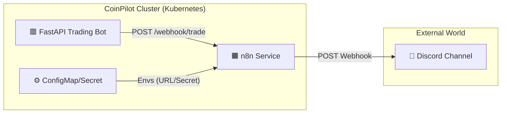

# Week 5: Notification System (n8n + Discord) - Walkthrough

**Project**: CoinPilot - AI-Powered Cryptocurrency Trading System
**Author**: Hur Youchan
**Date**: 2026-01-29
**Tech Stack**: n8n, Discord Webhook, Kubernetes, Python (httpx)

---

## Executive Summary

Week 5는 **실시간 알림 시스템**을 구축하는 단계였습니다. 노코드 자동화 도구인 **n8n**을 Kubernetes에 배포하고, **Discord Webhook**과 연동하여 매매 체결, 리스크 경고, 일일 리포트를 자동 발송하는 파이프라인을 완성했습니다. 이를 통해 사용자는 시스템을 24시간 감시하지 않아도 중요한 이벤트를 즉시 알 수 있게 되었습니다.

### Skills Demonstrated
`Workflow Automation (n8n)` `Webhook Integration` `Kubernetes Secret Management` `Async Python (httpx)` `Discord API` `Event-Driven Architecture`

### Deliverables at a Glance

| # | 산출물 | 설명 | 파일 위치 |
|---|--------|------|----------|
| 1 | n8n Deployment | K8s 매니페스트 (Deployment, Service, PVC) | `k8s/apps/n8n-deployment.yaml` |
| 2 | Notification Manager | 비동기 Webhook 전송 유틸리티 | `src/common/notification.py` |
| 3 | Engine Integration | Executor/RiskManager 알림 연동 | `src/engine/executor.py`, `risk_manager.py` |
| 4 | n8n Workflows | Trade, Risk, Daily Report 워크플로우 | n8n UI (PVC에 저장) |

---

## 1. 개요 (Overview)
Week 5의 목표는 **"사용자가 시스템을 항상 보고 있지 않아도 상태를 알 수 있게 하는 것"**입니다.
Kubernetes 클러스터에 **n8n(Workflow Automation)** 을 배포하고, **Discord Webhook**과 연동하여 실시간 알림 시스템을 성공적으로 구축했습니다.

-   **기간**: Week 5
-   **작업자**: Antigravity & User
-   **상태**: ✅ **완료 (Completed)**

---

## 2. 아키텍처 (Architecture)



### 핵심 흐름
1.  **Event**: 매매 엔진(Engine)에서 주문 체결 또는 리스크 발생.
2.  **Trigger**: Python 코드가 `n8n Service` (http://n8n:5678)로 Webhook 전송.
3.  **Process**: n8n 워크플로우가 데이터를 가공하고 포맷팅.
4.  **Notify**: Discord 채널로 최종 알림 전송.

---

## 3. 구현 단계별 요약 (Implementation Steps)

### Phase 1: 인프라 및 엔진 연동 (Infrastructure & Engine)
n8n을 쿠버네티스에 배포하고, 파이썬 매매 엔진이 신호를 보낼 수 있도록 수정했습니다.

-   **n8n 배포**: `k8s/apps/n8n-deployment.yaml` (StatefulSet, Service, PVC)
-   **Secret 관리**: `N8N_WEBHOOK_SECRET` (내부 인증용), `DISCORD_WEBHOOK_URL` (외부 전송용)
-   **Python 코드**: `notification.py` 유틸리티 추가 (비동기 전송, 재시도 로직)

### Phase 2: Discord 연동 및 워크플로우 (Integration)
실제 Discord 채널과 n8n을 연결하고, 3가지 핵심 워크플로우를 구현했습니다.

#### 1. Trade Notification (매매 알림)
-   **Trigger**: `POST /webhook/trade`
-   **Payload**: Symbol, Side(BUY/SELL), Price, Quantity
-   **Action**: 매매 체결 즉시 Discord로 알림 발송.

#### 2. Risk Alert (리스크 알림)
-   **Trigger**: `POST /webhook/risk`
-   **Payload**: Type(STOP_LOSS/COOLDOWN), Level(WARNING/CRITICAL), Message
-   **Action**: 위험 상황 발생 시 즉시 경고 메시지 발송.

#### 3. Daily Report (일일 리포트)
-   **Trigger**: Cron (매일 09:00 KST)
-   **Action**: 하루 동안의 시스템 상태 요약 리포트 발송 (현재는 기본 템플릿, 추후 고도화).

---

## 4. 트러블슈팅 (Troubleshooting)

Week 5 진행 중 발생한 주요 문제와 해결 방법은 별도의 트러블슈팅 문서에 상세히 기록했습니다.
👉 **[참고: troubleshooting/week5-ts.md](../troubleshooting/week5-ts.md)**

---

## 5. 검증 결과 (Verification Results)

### 5.1 인프라 검증
-   `kubectl get pods` → n8n 파드 **Running** 상태 확인.
-   `localhost:5678` → n8n 웹 UI 접속 확인.

### 5.2 기능 검증 (Test Scenarios)
| 시나리오 | 테스트 방법 | 결과 |
| :--- | :--- | :--- |
| **매매 알림** | `curl`로 가상 매수 신호 전송 | ✅ Discord 수신 성공 |
| **리스크 알림** | `curl`로 STOP_LOSS 신호 전송 | ✅ Discord 수신 성공 |
| **일일 리포트** | n8n UI에서 수동 트리거 실행 | ✅ Discord 수신 성공 |
| **보안 (Secret)** | 환경 변수 `{{$env...}}` 사용 확인 | ✅ 정상 작동 |

---

## 6. 결론 (Conclusion)
CoinPilot v3.0의 알림 시스템 구축이 완료되었습니다. 이제 사용자는 매매봇이 돌아가는 동안 계속 모니터링할 필요 없이, 중요한 이벤트가 발생했을 때 Discord를 통해 즉시 알 수 있게 되었습니다.

다음 단계인 **Week 6 (대시보드 구축)** 를 위한 기반이 마련되었습니다.

---

## 7. Key Learnings (핵심 학습 내용)

### 7.1 아키텍처 설계
| 학습 내용 | 적용 |
|----------|------|
| **Decoupled Architecture** | 매매 엔진과 알림 로직을 Webhook으로 분리하여 엔진 성능 영향 최소화 |
| **Event-Driven Design** | 동기식 알림 대신 `asyncio.create_task()`로 비동기 처리 |
| **Secret Management** | 민감 정보(Webhook URL)를 K8s Secret으로 분리하여 코드/설정 분리 |

### 7.2 n8n 워크플로우 자동화
| 학습 내용 | 적용 |
|----------|------|
| **노코드 자동화** | n8n을 활용하여 코드 없이 복잡한 알림 로직 구현 |
| **환경 변수 보안** | `N8N_BLOCK_ENV_ACCESS_IN_NODE: false` 설정으로 런타임 환경 변수 접근 |
| **Golden Config 패턴** | 검증된 설정 패턴을 문서화하여 재사용성 확보 |

### 7.3 Python 비동기 패턴
```python
# Fire-and-forget 패턴: 알림 실패가 매매 로직에 영향을 주지 않음
asyncio.create_task(notifier.send_webhook("/webhook/trade", {...}))

# Exponential Backoff: 일시적 장애에 대한 복원력
for attempt in range(max_retries):
    await asyncio.sleep(2 ** attempt)  # 1s, 2s, 4s
```

### 7.4 향후 개선 가능 영역
- **Rich Embeds**: Discord의 색상, 필드 구분 기능으로 메시지 가독성 향상
- **Dead Letter Queue**: 알림 실패 시 재처리를 위한 큐 시스템 도입
- **Metrics**: 알림 발송 성공률, 지연 시간 등 모니터링 지표 추가
